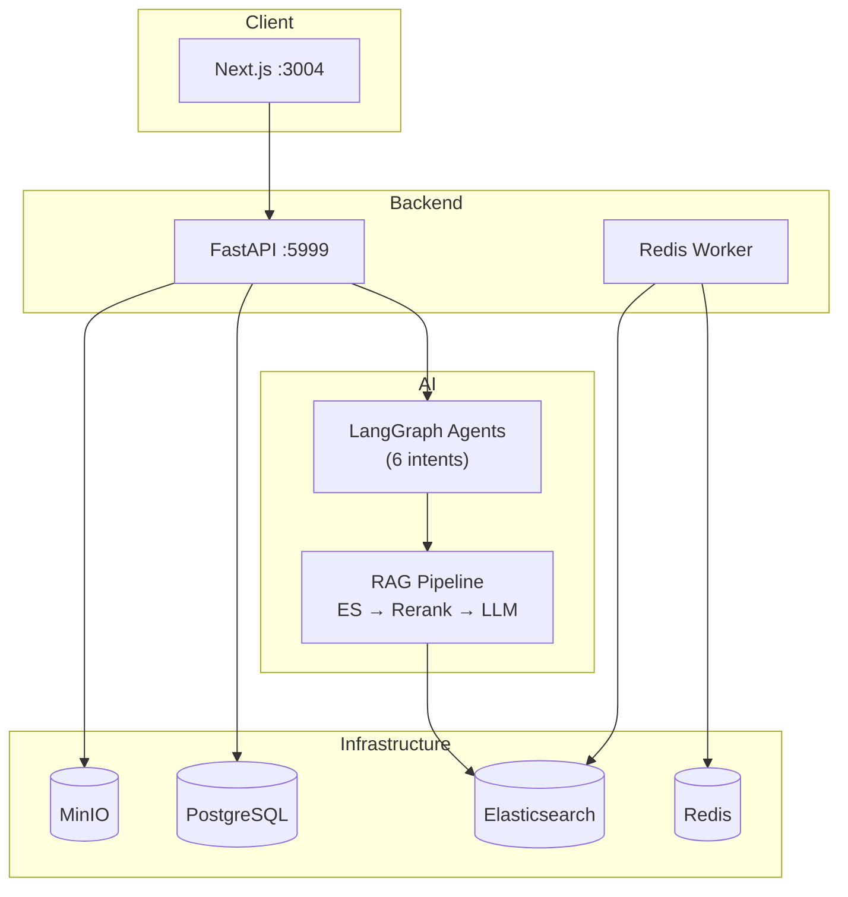

# Lex Companion

**Lex Companion** is a production-grade Vietnamese Legal AI Assistant that delivers citation-backed legal answers, research, and document generation through intent-aware LangGraph agents and hybrid Elasticsearch retrieval.

[](https://www.python.org/downloads/)
[](https://fastapi.tiangolo.com/)
[](https://langchain-ai.github.io/langgraph/)
[](https://nextjs.org/)

---

## Project Overview

Lex Companion helps legal professionals and citizens navigate Vietnamese law by combining:

- **Retrieval-Augmented Generation (RAG)** over the Pháp điển legal codex (~64k articles)
- **Hybrid search** (keyword + semantic vectors + reranking) in Elasticsearch
- **Multi-intent agent workflows** powered by LangGraph
- **Citation-based responses** with inline `[n]` references and IEEE-style source lists
- **Contract document generation** with human-in-the-loop (HITL) form filling

For detailed architecture documentation, see **[docs/ARCHITECTURE.md](docs/ARCHITECTURE.md)**.

---

## Features

| Feature | Description |
|---------|-------------|
| **Legal Q&A** | Ask questions about Vietnamese law; get answers grounded in Pháp điển articles |
| **Legal Research** | Multi-query RAG with ontology-aware query expansion and retry |
| **Hybrid Search** | Elasticsearch keyword + KNN vector fusion with BGE reranking |
| **Citation Tracking** | Every factual claim links to `[n]` inline citations and a reference panel |
| **Intent Routing** | 6 specialized agent workflows: information, decision, problem-solving, exploration, task execution, communication |
| **Document Generation** | Contract template selection, form fill, and DOCX output with HITL checkpoints |
| **User Knowledge Base** | Upload personal documents for session-scoped retrieval |
| **Legal Corpus Visualization** | Interactive graph of topics, subjects, and articles (admin) |
| **Web Fallback** | Tavily web search when legal corpus context is insufficient |
| **i18n** | Vietnamese and English UI |

---

## Architecture Overview



**Request flow:** User message → JWT auth → intent routing → LangGraph agent → hybrid retrieval → rerank → LLM with citations → persist & respond.

See [docs/ARCHITECTURE.md](docs/ARCHITECTURE.md) for complete diagrams covering request lifecycle, agent workflows, RAG pipeline, database design, and deployment.

---

## Technology Stack

| Layer | Technologies |
|-------|-------------|
| **Frontend** | Next.js 16, React 19, TanStack Query, Tailwind CSS 4 |
| **Backend** | FastAPI, Uvicorn, Peewee ORM, Pydantic v2 |
| **AI/Agents** | LangGraph, LangChain, FlagEmbedding |
| **Search** | Elasticsearch 8.13 (hybrid keyword + KNN) |
| **Embedding** | AITeamVN/Vietnamese_Embedding_v2 (1024 dims) |
| **Reranking** | BAAI/bge-reranker-v2-m3 |
| **LLM** | OpenAI-compatible API |
| **Document Processing** | Docling, PyMuPDF, python-docx |
| **Storage** | PostgreSQL, MinIO, Redis |
| **Package Management** | [uv](https://docs.astral.sh/uv/) (Python), npm (Frontend) |

---

## Quick Start

### Prerequisites

| Component | Version |
|-----------|---------|
| Python | 3.12+ |
| [uv](https://docs.astral.sh/uv/getting-started/installation/) | Latest |
| Docker | For infrastructure services |
| Node.js | 20+ (for frontend) |

### 1. Clone and configure

```bash
git clone <repository-url>
cd langgraph-base
cp .env.example .env
# Edit .env with your credentials (see Configuration section)
```

### 2. Start with Docker Compose (recommended)

```bash
# Linux: ensure ES can start
sudo sysctl -w vm.max_map_count=262144

docker compose -f docker/docker-compose.yml up -d --build
```

| Service | URL |
|---------|-----|
| Web UI | http://localhost:3005 |
| API | http://localhost:6000 |
| API Docs | http://localhost:6000/docs |
| Kibana | http://localhost:5602 |

### 3. Or run locally (development)

**Infrastructure** (Postgres, MinIO, Redis, Elasticsearch):
```bash
# See api/deployment.readme.md and
# model_serving/retrievers/elastic_search/deployment.readme.md
```

**Backend:**
```bash
uv venv --python 3.12
uv sync
uv run --env-file .env python -m api.lex_companion_server
# API at http://localhost:5999
```

**Frontend:**
```bash
cd web
npm install
npm run dev
# UI at http://localhost:3004
```

---

## Installation

### Backend dependencies

All Python dependencies are managed via `uv` from the repository root:

```bash
uv sync                  # Install production dependencies
uv sync --group dev      # Include LangGraph CLI for development
```

> **Important:** Do not run `uv pip install -e .` — this project uses `package = false` and runs via `PYTHONPATH`.

### Frontend dependencies

```bash
cd web
npm install
```

### Embedding service (optional, self-hosted)

```bash
cd model_serving/embeddings/vie_embedding_v2
python -m venv .venv && source .venv/bin/activate
pip install -r requirements.txt
python app.py  # Runs on port 6501
```

---

## Configuration

Copy `.env.example` to `.env` and configure:

### Required

```bash
# Database
POSTGRES_USER=your_user
POSTGRES_PASSWORD=your_password
POSTGRES_DB=lex_companion
POSTGRES_HOST=localhost
POSTGRES_PORT=5432

# Object Storage
MINIO_HOST=localhost:6503
MINIO_USER=your_user
MINIO_PASSWORD=your_password
MINIO_BUCKET=lex-companion

# Search
ELASTIC_HOST=localhost:6505
ELASTIC_PASSWORD=your_password
LEX_CHUNKS_INDEX=lex_chunks_v1
LEGAL_VECTOR_DIMS=1024

# LLM
OPENAI_API_KEY=your_key
OPENAI_BASE_URL=https://api.openai.com/v1
LLM_MODEL=gpt-4o

# Embedding
EMBEDDING_PROVIDER=openai
EMBEDDING_BASE_URL=http://localhost:6501/v1
EMBEDDING_MODEL=AITeamVN/Vietnamese_Embedding_v2

# Auth
JWT_SECRET_KEY=your_secret
GOOGLE_CLIENT_ID=your_client_id
GOOGLE_CLIENT_SECRET=your_client_secret
GOOGLE_REDIRECT_URI=http://localhost:3004/auth/google/callback
```

### Recommended

```bash
# Reranking (significantly improves retrieval quality)
RERANK_ENABLED=true
RERANK_MODEL_NAME=BAAI/bge-reranker-v2-m3

# Redis (enables background document processing)
REDIS_HOST=localhost
REDIS_PORT=6376
REDIS_PASSWORD=your_password

# Web search fallback
TAVILY_API_KEY=your_key
```

### Frontend (build-time)

```bash
# web/.env
NEXT_PUBLIC_API_SERVER=http://localhost:5999
NEXT_PUBLIC_GOOGLE_CLIENT_ID=your_client_id
NEXT_PUBLIC_GOOGLE_OAUTH2_CALLBACK=http://localhost:3004/auth/google/callback
```

See [docs/ARCHITECTURE.md](docs/ARCHITECTURE.md#deployment-architecture) for the complete environment variable reference.

---

## Development

### Project structure

```
langgraph-base/
├── api/                    # FastAPI backend
│   ├── lex_companion_server.py
│   ├── apps/
│   │   ├── routers/        # Auto-loaded route definitions
│   │   ├── controllers/    # Request handlers
│   │   └── services/       # Business logic + orchestration
│   ├── db/models.py        # Peewee ORM models
│   └── worker/             # Redis stream background worker
├── deepagent/              # LangGraph agents + document processing
│   ├── multiagent/legal_assistant/  # Intent-specific graph workflows
│   └── core/               # Rerank, splitters, embeddings, HITL
├── model_serving/          # Standalone embedding + LLM services
├── web/                    # Next.js frontend
├── docker/                 # Docker Compose + Dockerfiles
├── docs/                   # Technical documentation
├── scripts/                # Startup scripts
├── pyproject.toml          # Python dependencies (uv)
└── .env.example            # Environment template
```

### Running the API

```bash
# Recommended
uv run --env-file .env python -m api.lex_companion_server

# Or via script
./scripts/start_lex_api.sh
```

- API: http://localhost:5999
- OpenAPI docs: http://localhost:5999/docs

> Do **not** run `python api/lex_companion_server.py` directly — use `python -m api.lex_companion_server` with `PYTHONPATH=.`.

### Adding dependencies

```bash
uv add requests              # Production dependency
uv add --dev pytest          # Dev dependency
uv sync                      # Reinstall from lockfile
```

### Creating new API endpoints

Follow the layered pattern documented in `api_creating_instruction.md`:

```
Router → Controller → Service → DB/ES/Agent
```

### LangGraph development

```bash
uv sync --group dev
uv run langgraph dev
```

> Note: `langgraph.json` references a legacy graph path. Active graphs are in `deepagent/multiagent/legal_assistant/`.

### Running tests

```bash
uv run python -m pytest tests/
```

---

## Deployment

### Docker Compose (full stack)

```bash
docker compose -f docker/docker-compose.yml up -d --build
```

Services and ports:

| Service | Host Port | Purpose |
|---------|-----------|---------|
| PostgreSQL | 5445 | Relational database |
| MinIO | 6503/6504 | Object storage |
| Redis | 6376 | Task queue |
| Elasticsearch | 6505 | Search + vectors |
| Kibana | 5602 | ES management UI |
| Embedding | 6502 | Vietnamese embedding model |
| API | 6000 | FastAPI backend |
| Web | 3005 | Next.js frontend |

### Production considerations

- Set strong secrets for `JWT_SECRET_KEY`, database passwords, and MinIO credentials
- Configure `RERANK_DEVICE=cuda:0` if GPU is available
- Implement persistent checkpointer (Redis/Postgres scaffold exists) for HITL reliability
- Import Pháp điển corpus via `POST /v1/admin/doc/upload` after deployment
- No CI/CD pipeline is included — set up your own (Inferred from implementation)

See [docs/ARCHITECTURE.md](docs/ARCHITECTURE.md#deployment-architecture) for networking diagrams and detailed deployment notes.

---

## API Overview

| Domain | Prefix | Key Endpoints |
|--------|--------|---------------|
| Auth | `/v1/user` | `POST /oAuth-login` |
| Chat | `/v1/user` | `POST /user_chat`, `GET /sessions`, `GET /session` |
| Contract | `/v1/user` | `POST /contract/fill`, `GET /contract/draft/*` |
| Documents | `/v1` | `POST /doc/upload`, `GET /docs`, `POST /doc/run` |
| Admin | `/v1/admin` | `POST /doc/retrieval`, `POST /doc/upload`, `GET /doc/topic` |

Full API documentation with inputs/outputs: [docs/ARCHITECTURE.md](docs/ARCHITECTURE.md#api-documentation)

Interactive docs available at `/docs` when the API is running.

---

## Contributing

1. Fork the repository
2. Create a feature branch (`git checkout -b feature/your-feature`)
3. Follow the existing code patterns:
   - Backend: Router → Controller → Service layering
   - Agents: Add nodes to intent-specific graphs in `deepagent/multiagent/legal_assistant/`
   - Frontend: React Query hooks in `web/hooks/`, services in `web/service/`
4. Run tests: `uv run python -m pytest tests/`
5. Submit a pull request

### Code conventions

- Python 3.12+, type hints, Pydantic v2 models
- Peewee ORM for database (not SQLAlchemy)
- LangGraph `StateGraph` with typed state (`LegalAssistantState`)
- API response envelope: `{ code, msg, data }`
- Environment variables via `.env` (never commit secrets)

---

## License

Maintained by project contributors.

---

## Documentation

| Document | Description |
|----------|-------------|
| [docs/ARCHITECTURE.md](docs/ARCHITECTURE.md) | Full technical architecture (agents, RAG, database, deployment) |
| [api/deployment.readme.md](api/deployment.readme.md) | Manual Docker run for Postgres/MinIO/Redis |
| [api_creating_instruction.md](api_creating_instruction.md) | API development conventions |
| [model_serving/retrievers/elastic_search/deployment.readme.md](model_serving/retrievers/elastic_search/deployment.readme.md) | Elasticsearch setup |
