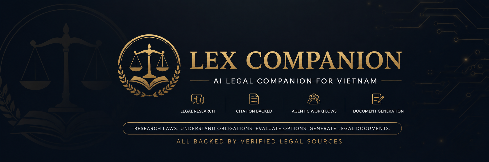
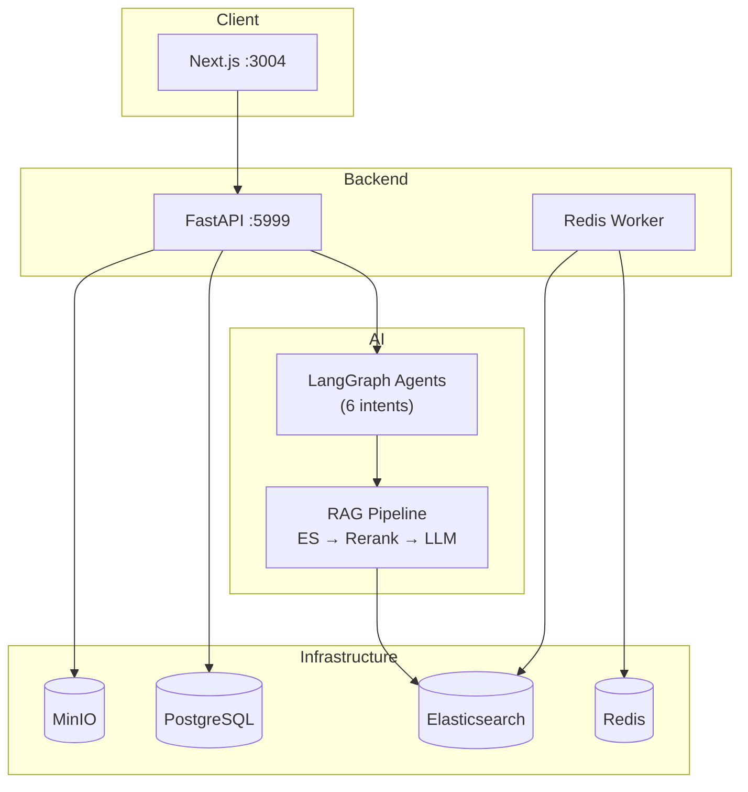

<p align="center">
  
</p>

<h1 align="center">Lex Companion</h1>

<p align="center">
  <strong>Trợ lý pháp lý AI · Luật Việt Nam</strong>
</p>

<p align="center">
  🇻🇳 Tiếng Việt · <a href="README.md">🇬🇧 English</a>
</p>

**Lex Companion** là trợ lý pháp lý AI dạng agentic dành cho Việt Nam, giúp cá nhân và doanh nghiệp hiểu quy định pháp luật, nghiên cứu vấn đề pháp lý, đánh giá phương án và tạo văn bản pháp lý thông qua các agent chuyên biệt, dựa trên nguồn pháp luật có thẩm quyền.

[](https://www.python.org/downloads/)
[](https://fastapi.tiangolo.com/)
[](https://langchain-ai.github.io/langgraph/)
[](https://nextjs.org/)

---

## Tổng quan dự án

Việc tra cứu pháp luật Việt Nam thường đòi hỏi tìm kiếm trong hàng nghìn điều luật, hiểu mối quan hệ giữa các văn bản và chuyển ngôn ngữ pháp lý thành hành động thực tế.

Lex Companion hoạt động như một trợ lý pháp lý AI hỗ trợ người dùng trong toàn bộ quy trình này. Thay vì hoạt động như chatbot truyền thống, hệ thống điều phối các agent pháp lý chuyên biệt có khả năng nghiên cứu pháp luật, truy xuất thông tin, soạn thảo văn bản, hỗ trợ ra quyết định và giải quyết vấn đề.

Các khả năng cốt lõi:

- **Luồng pháp lý agentic** với LangGraph agent theo intent
- **Suy luận pháp lý có căn cứ** trên Pháp điển Việt Nam (~64k điều)
- **Kiến trúc truy xuất hybrid** kết hợp tìm kiếm từ khóa, semantic và reranking
- **Phản hồi có trích dẫn** với tham chiếu minh bạch tới nguồn pháp luật
- **Sinh văn bản human-in-the-loop** cho hợp đồng và biểu mẫu pháp lý
- **Bổ sung tri thức theo phiên** qua tài liệu do người dùng cung cấp

Tài liệu kiến trúc chi tiết: **[docs/ARCHITECTURE.vi.md](docs/ARCHITECTURE.vi.md)** (tiếng Việt) · [docs/ARCHITECTURE.md](docs/ARCHITECTURE.md) (English)

---

## Tính năng

| Tính năng | Mô tả |
| --------- | ----- |
| **Hỏi đáp pháp luật** | Đặt câu hỏi về luật Việt Nam; nhận câu trả lời dựa trên điều Pháp điển |
| **Nghiên cứu pháp lý** | RAG đa truy vấn với mở rộng truy vấn theo ontology và retry |
| **Tìm kiếm hybrid** | Elasticsearch keyword + KNN vector fusion với BGE reranking |
| **Theo dõi trích dẫn** | Mỗi luận điểm liên kết tới trích dẫn `[n]` inline và panel tham chiếu |
| **Định tuyến intent** | 6 luồng agent: information, decision, problem-solving, exploration, task execution, communication |
| **Sinh văn bản** | Chọn mẫu hợp đồng, điền form, xuất DOCX với checkpoint HITL |
| **Knowledge Base người dùng** | Upload tài liệu cá nhân để truy xuất trong phiên chat |
| **Trực quan hóa corpus pháp luật** | Đồ thị tương tác chủ đề, đề mục, điều luật (admin) |
| **Web fallback** | Tìm kiếm Tavily khi ngữ cảnh corpus pháp luật không đủ |
| **i18n** | Giao diện tiếng Việt và tiếng Anh |

---

## Tổng quan kiến trúc



**Luồng request:** Tin nhắn người dùng → xác thực JWT → định tuyến intent → LangGraph agent → truy xuất hybrid → rerank → LLM kèm trích dẫn → lưu & phản hồi.

Xem [docs/ARCHITECTURE.vi.md](docs/ARCHITECTURE.vi.md) để biết sơ đồ đầy đủ về vòng đời request, agent workflow, pipeline RAG, thiết kế database và triển khai.

---

## Công nghệ sử dụng

| Tầng | Công nghệ |
| ---- | --------- |
| **Frontend** | Next.js 16, React 19, TanStack Query, Tailwind CSS 4 |
| **Backend** | FastAPI, Uvicorn, Peewee ORM, Pydantic v2 |
| **AI/Agents** | LangGraph, LangChain, FlagEmbedding |
| **Search** | Elasticsearch 8.13 (hybrid keyword + KNN) |
| **Embedding** | AITeamVN/Vietnamese_Embedding_v2 (1024 dims) |
| **Reranking** | BAAI/bge-reranker-v2-m3 |
| **LLM** | OpenAI-compatible API |
| **Xử lý tài liệu** | Docling, PyMuPDF, python-docx |
| **Lưu trữ** | PostgreSQL, MinIO, Redis |
| **Quản lý package** | [uv](https://docs.astral.sh/uv/) (Python), npm (Frontend) |

---

## Khởi động nhanh

### Yêu cầu

| Thành phần | Phiên bản |
| ---------- | --------- |
| Python | 3.12+ |
| [uv](https://docs.astral.sh/uv/getting-started/installation/) | Mới nhất |
| Docker | Cho các dịch vụ hạ tầng |
| Node.js | 20+ (cho frontend) |

### 1. Clone và cấu hình

```bash
git clone <repository-url>
cd langgraph-base
cp .env.example .env
# Chỉnh .env với thông tin đăng nhập (xem mục Cấu hình)
```

### 2. Khởi động bằng Docker Compose (khuyến nghị)

```bash
# Linux: đảm bảo ES có thể khởi động
sudo sysctl -w vm.max_map_count=262144

docker compose -f docker/docker-compose.yml up -d --build
```

| Dịch vụ | URL |
| ------- | --- |
| Web UI | http://localhost:3005 |
| API | http://localhost:6000 |
| API Docs | http://localhost:6000/docs |
| Kibana | http://localhost:5602 |

### 3. Hoặc chạy local (phát triển)

**Hạ tầng** (Postgres, MinIO, Redis, Elasticsearch):

```bash
# Xem api/deployment.readme.md và
# model_serving/retrievers/elastic_search/deployment.readme.md
```

**Backend:**

```bash
uv venv --python 3.12
uv sync
uv run --env-file .env python -m api.lex_companion_server
# API tại http://localhost:5999
```

**Frontend:**

```bash
cd web
npm install
npm run dev
# UI tại http://localhost:3004
```

---

## Cài đặt

### Dependency backend

Tất cả dependency Python được quản lý qua `uv` từ root repository:

```bash
uv sync                  # Cài dependency production
uv sync --group dev      # Bao gồm LangGraph CLI cho phát triển
```

> **Quan trọng:** Không chạy `uv pip install -e .` — project dùng `package = false` và chạy qua `PYTHONPATH`.

### Dependency frontend

```bash
cd web
npm install
```

### Dịch vụ embedding (tùy chọn, self-hosted)

```bash
cd model_serving/embeddings/vie_embedding_v2
python -m venv .venv && source .venv/bin/activate
pip install -r requirements.txt
python app.py  # Chạy trên cổng 6501
```

---

## Cấu hình

Sao chép `.env.example` thành `.env` và cấu hình:

### Bắt buộc

```bash
# Database
POSTGRES_USER=your_user
POSTGRES_PASSWORD=your_password
POSTGRES_DB=lex_companion
POSTGRES_HOST=localhost
POSTGRES_PORT=5432

# Object Storage
MINIO_HOST=localhost:6503
MINIO_USER=your_user
MINIO_PASSWORD=your_password
MINIO_BUCKET=lex-companion

# Search
ELASTIC_HOST=localhost:6505
ELASTIC_PASSWORD=your_password
LEX_CHUNKS_INDEX=lex_chunks_v1
LEGAL_VECTOR_DIMS=1024

# LLM
OPENAI_API_KEY=your_key
OPENAI_BASE_URL=https://api.openai.com/v1
LLM_MODEL=gpt-4o

# Embedding
EMBEDDING_PROVIDER=openai
EMBEDDING_BASE_URL=http://localhost:6501/v1
EMBEDDING_MODEL=AITeamVN/Vietnamese_Embedding_v2

# Auth
JWT_SECRET_KEY=your_secret
GOOGLE_CLIENT_ID=your_client_id
GOOGLE_CLIENT_SECRET=your_client_secret
GOOGLE_REDIRECT_URI=http://localhost:3004/auth/google/callback
```

### Khuyến nghị

```bash
# Reranking (cải thiện đáng kể chất lượng truy xuất)
RERANK_ENABLED=true
RERANK_MODEL_NAME=BAAI/bge-reranker-v2-m3

# Redis (bật xử lý tài liệu nền)
REDIS_HOST=localhost
REDIS_PORT=6376
REDIS_PASSWORD=your_password

# Web search fallback
TAVILY_API_KEY=your_key
```

### Frontend (build-time)

```bash
# web/.env
NEXT_PUBLIC_API_SERVER=http://localhost:5999
NEXT_PUBLIC_GOOGLE_CLIENT_ID=your_client_id
NEXT_PUBLIC_GOOGLE_OAUTH2_CALLBACK=http://localhost:3004/auth/google/callback
```

Xem [docs/ARCHITECTURE.vi.md](docs/ARCHITECTURE.vi.md#kiến-trúc-triển-khai) để biết danh sách biến môi trường đầy đủ.

---

## Phát triển

### Cấu trúc dự án

```
langgraph-base/
├── api/                    # FastAPI backend
│   ├── lex_companion_server.py
│   ├── apps/
│   │   ├── routers/        # Route tự động load
│   │   ├── controllers/    # Request handlers
│   │   └── services/       # Business logic + orchestration
│   ├── db/models.py        # Peewee ORM models
│   └── worker/             # Redis stream background worker
├── deepagent/              # LangGraph agents + xử lý tài liệu
│   ├── multiagent/legal_assistant/  # Graph workflow theo intent
│   └── core/               # Rerank, splitters, embeddings, HITL
├── model_serving/          # Dịch vụ embedding + LLM độc lập
├── web/                    # Next.js frontend
├── docker/                 # Docker Compose + Dockerfiles
├── docs/                   # Tài liệu kỹ thuật
├── scripts/                # Script khởi động
├── pyproject.toml          # Python dependencies (uv)
└── .env.example            # Template môi trường
```

### Chạy API

```bash
# Khuyến nghị
uv run --env-file .env python -m api.lex_companion_server

# Hoặc qua script
./scripts/start_lex_api.sh
```

- API: http://localhost:5999
- OpenAPI docs: http://localhost:5999/docs

> **Không** chạy `python api/lex_companion_server.py` trực tiếp — dùng `python -m api.lex_companion_server` với `PYTHONPATH=.`.

### Thêm dependency

```bash
uv add requests              # Dependency production
uv add --dev pytest          # Dependency dev
uv sync                      # Cài lại từ lockfile
```

### Tạo API endpoint mới

Theo pattern phân lớp trong `api_creating_instruction.md`:

```
Router → Controller → Service → DB/ES/Agent
```

### Phát triển LangGraph

```bash
uv sync --group dev
uv run langgraph dev
```

> Lưu ý: `langgraph.json` trỏ graph path cũ. Graph đang hoạt động nằm trong `deepagent/multiagent/legal_assistant/`.

### Chạy test

```bash
uv run python -m pytest tests/
```

---

## Triển khai

### Docker Compose (full stack)

```bash
docker compose -f docker/docker-compose.yml up -d --build
```

Dịch vụ và cổng:

| Dịch vụ | Cổng host | Mục đích |
| ------- | --------- | -------- |
| PostgreSQL | 5445 | Cơ sở dữ liệu quan hệ |
| MinIO | 6503/6504 | Object storage |
| Redis | 6376 | Hàng đợi task |
| Elasticsearch | 6505 | Search + vectors |
| Kibana | 5602 | Giao diện quản lý ES |
| Embedding | 6502 | Model embedding tiếng Việt |
| API | 6000 | FastAPI backend |
| Web | 3005 | Next.js frontend |

### Lưu ý production

- Đặt secret mạnh cho `JWT_SECRET_KEY`, mật khẩu database và MinIO
- Cấu hình `RERANK_DEVICE=cuda:0` nếu có GPU
- Triển khai checkpointer persistent (scaffold Redis/Postgres đã có) để HITL ổn định
- Import corpus Pháp điển qua `POST /v1/admin/doc/upload` sau khi deploy
- Chưa có pipeline CI/CD — cần tự thiết lập *(suy luận từ implementation)*

Xem [docs/ARCHITECTURE.vi.md](docs/ARCHITECTURE.vi.md#kiến-trúc-triển-khai) để biết sơ đồ mạng và ghi chú triển khai chi tiết.

---

## Tổng quan API

| Domain | Prefix | Endpoint chính |
| ------ | ------ | -------------- |
| Auth | `/v1/user` | `POST /oAuth-login` |
| Chat | `/v1/user` | `POST /user_chat`, `GET /sessions`, `GET /session` |
| Contract | `/v1/user` | `POST /contract/fill`, `GET /contract/draft/*` |
| Documents | `/v1` | `POST /doc/upload`, `GET /docs`, `POST /doc/run` |
| Admin | `/v1/admin` | `POST /doc/retrieval`, `POST /doc/upload`, `GET /doc/topic` |

Tài liệu API đầy đủ (input/output): [docs/ARCHITECTURE.vi.md](docs/ARCHITECTURE.vi.md#tài-liệu-api)

Tài liệu tương tác tại `/docs` khi API đang chạy.

---

## Đóng góp

1. Fork repository
2. Tạo nhánh feature (`git checkout -b feature/your-feature`)
3. Tuân theo pattern code hiện có:
   - Backend: phân lớp Router → Controller → Service
   - Agents: thêm nodes vào graph theo intent trong `deepagent/multiagent/legal_assistant/`
   - Frontend: React Query hooks trong `web/hooks/`, services trong `web/service/`
4. Chạy test: `uv run python -m pytest tests/`
5. Gửi pull request

### Quy ước code

- Python 3.12+, type hints, Pydantic v2 models
- Peewee ORM cho database (không dùng SQLAlchemy)
- LangGraph `StateGraph` với typed state (`LegalAssistantState`)
- Envelope API response: `{ code, msg, data }`
- Biến môi trường qua `.env` (không commit secrets)

---

## Giấy phép

Được duy trì bởi các contributor của dự án.

---

## Tài liệu

| Tài liệu | Mô tả |
| -------- | ----- |
| [docs/ARCHITECTURE.vi.md](docs/ARCHITECTURE.vi.md) | Kiến trúc kỹ thuật đầy đủ (tiếng Việt) |
| [docs/ARCHITECTURE.md](docs/ARCHITECTURE.md) | Kiến trúc kỹ thuật (English) |
| [api/deployment.readme.md](api/deployment.readme.md) | Docker thủ công cho Postgres/MinIO/Redis |
| [api_creating_instruction.md](api_creating_instruction.md) | Quy ước phát triển API |
| [model_serving/retrievers/elastic_search/deployment.readme.md](model_serving/retrievers/elastic_search/deployment.readme.md) | Thiết lập Elasticsearch |

---

## Lời cảm ơn

Lex Companion không thể tồn tại nếu thiếu dữ liệu pháp luật mở từ cộng đồng.

Chúng tôi trân trọng cảm ơn **[tmquan/phapdien-moj-gov-vn](https://huggingface.co/datasets/tmquan/phapdien-moj-gov-vn)** trên Hugging Face đã công bố dataset Pháp điển Việt Nam từ Bộ Tư pháp. Dự án sử dụng nhiều config từ dataset này — bao gồm [tree_nodes](https://huggingface.co/datasets/tmquan/phapdien-moj-gov-vn/viewer/tree_nodes), articles, subjects và metadata ontology — làm nền tảng cho knowledge base pháp luật, pipeline index Elasticsearch và truy xuất có trích dẫn.

Cảm ơn các maintainer và contributor của dataset đã chia sẻ tri thức pháp luật Việt Nam có cấu trúc một cách công khai.

---

## Lộ trình & Cải tiến tương lai

Lex Companion đang phát triển hướng tới **trợ lý pháp lý agentic đầy đủ cho Việt Nam**. Luồng RAG cốt lõi và intent information đã sẵn sàng; một số agent chuyên biệt vẫn cần hoàn thiện.

### Hoàn thiện agent

| Agent | Đường dẫn | Trạng thái hiện tại | Mục tiêu |
| ----- | --------- | ------------------- | -------- |
| **Decision** | `deepagent/multiagent/legal_assistant/decision/` | Luồng single-node: retrieval + options/estimate placeholder | Suy luận quyết định đa bước — phân tích rủi ro, so sánh phương án, ánh xạ hậu quả và khuyến nghị có cấu trúc dựa trên luật truy xuất |
| **Problem solving** | `deepagent/multiagent/legal_assistant/problem_solving/` | Luồng single-node: retrieval + template chiến lược tĩnh | Phân rã vấn đề pháp lý động — kế hoạch hành động từng bước, theo dõi milestone và làm rõ lặp lại khi thiếu sự kiện |

Các hạng mục khác trên lộ trình:

- **Exploration agent** — nghiên cứu pháp lý mở rộng với fusion web + corpus
- **Persistent HITL checkpointing** — checkpointer Redis/Postgres để resume điền hợp đồng ổn định sau restart
- **User document ingestion** — hoàn thiện pipeline parse Docling cho tài liệu KB upload
- **Calculator tools** — logic ước tính phạt/thiệt hại thực tế (hiện là placeholder)
- **CI/CD & production hardening** — test tự động, pipeline triển khai và observability

Mọi đóng góp cho các hạng mục trên đều được hoan nghênh — xem [Đóng góp](#đóng-góp) ở trên.
