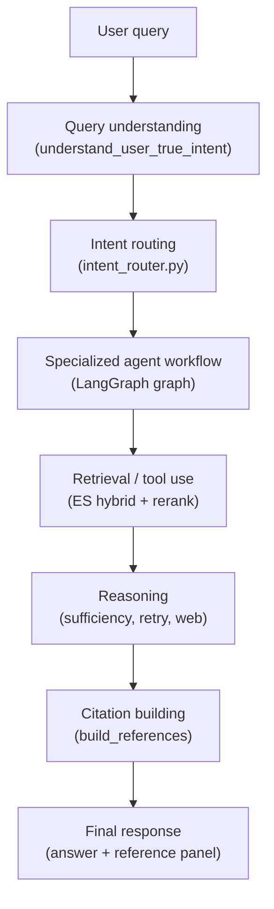
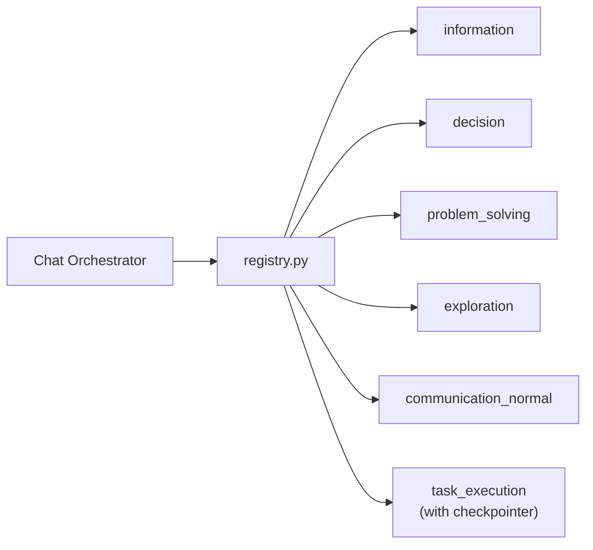
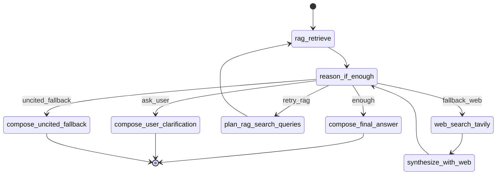
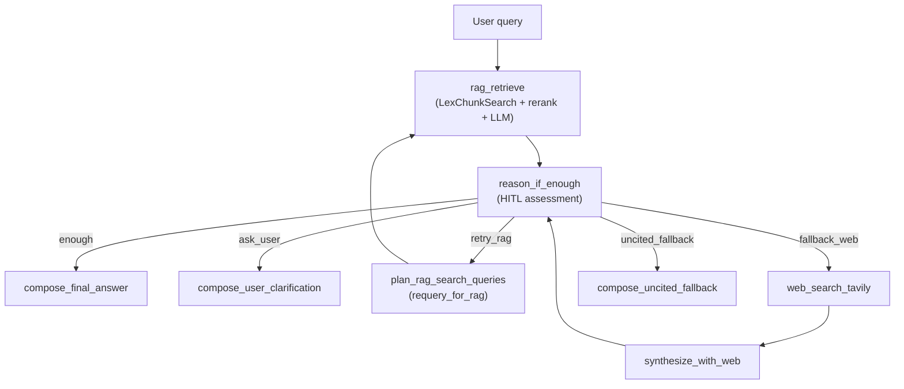
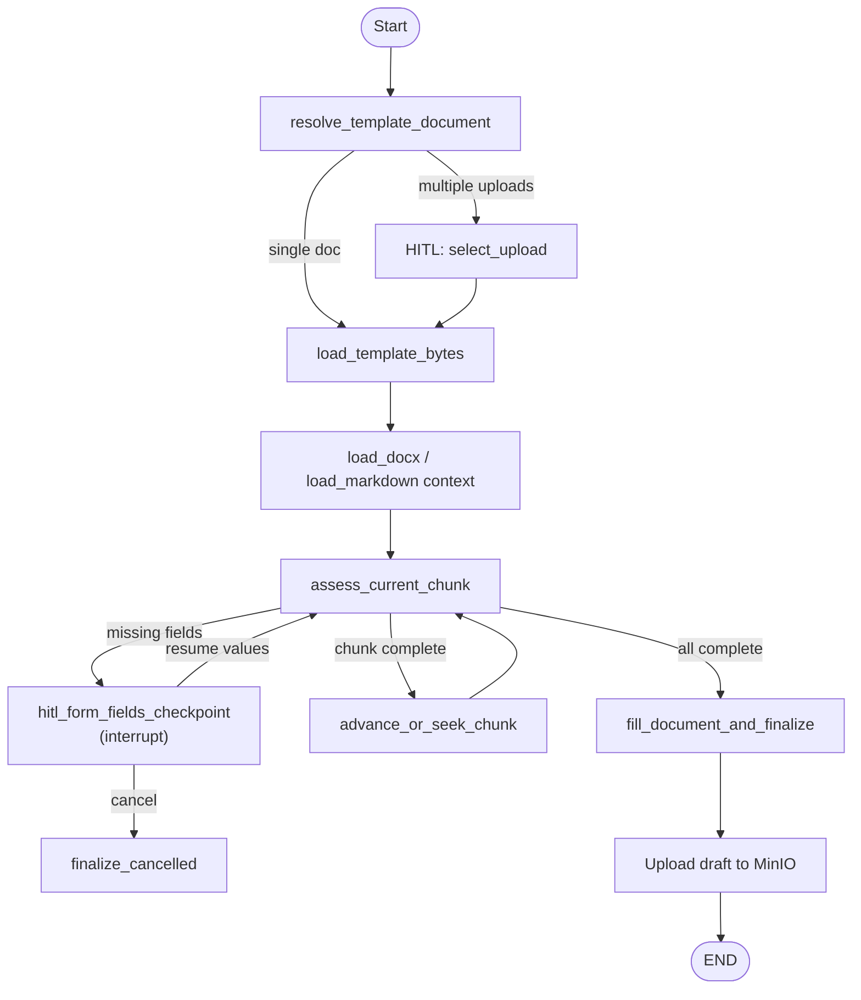

# Lex Companion — Agent System

This document describes the agent system for human contributors. All content reflects the **current implementation** — scaffolded or partial features are marked explicitly.

<p align="right">
  For AI agent instructions, see <a href="../CLAUDE.md">CLAUDE.md</a> at the repository root.
</p>

---

## Table of Contents

1. [Agent System Overview](#agent-system-overview)
2. [High-Level Agent Flow](#high-level-agent-flow)
3. [Supported Intents / Agents](#supported-intents--agents)
4. [Agent State Model](#agent-state-model)
5. [Graph Execution Model](#graph-execution-model)
6. [RAG Inside Agents](#rag-inside-agents)
7. [Human-in-the-Loop Workflows](#human-in-the-loop-workflows)
8. [Adding a New Agent](#adding-a-new-agent)
9. [Documentation Rules](#documentation-rules)

---

## Agent System Overview

Lex Companion uses **intent-aware LangGraph agents** instead of a single monolithic chatbot. When a user sends a message:

1. The API resolves conversational context (`understand_user_true_intent`)
2. An LLM intent router classifies the request into one of six intents
3. The chat orchestrator invokes the matching LangGraph workflow
4. The workflow retrieves legal context, reasons, builds citations, and returns a structured response

This design allows specialized behavior — factual legal Q&A with retry loops, social chat without RAG, or multi-step contract filling with HITL checkpoints — while sharing a common state model and retrieval infrastructure.

**Entry points:**
- API orchestration: `api/apps/services/orchestration/chat_orchestrator.py`
- Intent classification: `api/apps/services/orchestration/intent_router.py`
- Graph registry: `deepagent/multiagent/legal_assistant/registry.py`

---

## High-Level Agent Flow



### Agent routing diagram



Graphs are compiled once and cached. Only `task_execution` uses a LangGraph checkpointer (`InMemorySaver`).

---

## Supported Intents / Agents

Six intents are defined in `deepagent/multiagent/legal_assistant/shared/state.py`:

```python
IntentType = Literal[
    "information",
    "decision",
    "task_execution",
    "problem_solving",
    "exploration",
    "communication_normal",
]
```

---

### 1. Information (`information/`)

**Purpose:** Primary legal Q&A workflow — hybrid RAG with retry, HITL clarification, web fallback, and uncited fallback.

**Status:** ✅ **Fully implemented** — most complete agent graph.

**Input:** `user_query`, `resolved_user_request`, retrieval tuning params, optional `topic_ids`/`subject_ids`/`doc_ids`, `chat_history`, injected `reranker`.

**Main nodes** (`information/graph.py`):

| Node | Role |
|------|------|
| `rag_retrieve` | Hybrid ES search → rerank → cited LLM answer |
| `reason_if_enough` | HITL assessment of context sufficiency |
| `plan_rag_search_queries` | Ontology-aware query expansion (retry) |
| `web_search_tavily` | Tavily web search fallback |
| `synthesize_with_web` | LLM synthesis over web results |
| `compose_final_answer` | Package cited RAG answer |
| `compose_user_clarification` | Partial answer + clarification questions |
| `compose_uncited_fallback` | General knowledge with explicit disclaimer |

**Retrieval / tool usage:** `run_legal_retrieval()` / `run_legal_retrieval_multi()` via `tools/legal_retrieval.py`. Web via `tools/web_search.py` on fallback path only.

**Output:** `{ query, answer, reference[], answer_mode, web_search_used, rag_iteration, retrieval_attempts }`

**Current limitations:**
- Max 2 RAG retry iterations before web fallback
- Web synthesis quality depends on Tavily results

**Planned improvements (from README roadmap):** Richer exploration-style web + corpus fusion (partially addressed in exploration agent).

---

### 2. Decision (`decision/`)

**Purpose:** Legal decision guidance — "what should I do?", "how much is the fine?", option comparison.

**Status:** ⚠️ **Partial** — single-node graph; placeholder options and calculator.

**Input:** `user_query`, retrieval params, session context.

**Main nodes:**

| Node | Role |
|------|------|
| `run_decision_flow` | Single retrieval + static decision options + fine estimate |

**Retrieval / tool usage:** `run_legal_retrieval()`. Calculator via `compute_decision_estimate()` → `estimate_fine_range()` (returns `min: None, max: None`).

**Output:** Retrieval payload + `decision_options` (2 static strings) + `decision_estimate` placeholder.

**Current limitations:**
- No multi-step reasoning, risk analysis, or dynamic option generation
- Calculator is a placeholder

**Planned improvements (README roadmap):** Multi-step decision reasoning — risk analysis, option comparison, consequence mapping, structured recommendations grounded in retrieved law.

---

### 3. Problem Solving (`problem_solving/`)

**Purpose:** Structured guidance for concrete legal situations requiring step-by-step action plans.

**Status:** ⚠️ **Partial** — single-node graph; static strategy template.

**Input:** `user_query`, retrieval params, session context.

**Main nodes:**

| Node | Role |
|------|------|
| `run_problem_solving_flow` | Retrieval + static 3-step plan |

**Retrieval / tool usage:** `run_legal_retrieval()`. Strategy from `build_problem_strategy()` (hardcoded T+0/T+1/T+3 steps).

**Output:** Retrieval payload + `problem_plan` (static list).

**Current limitations:**
- Plan is not query-specific or dynamically generated
- No iterative clarification loop

**Planned improvements (README roadmap):** Dynamic legal problem decomposition — step-by-step action plans, milestone tracking, iterative clarification when facts are incomplete.

---

### 4. Exploration (`exploration/`)

**Purpose:** Open-ended legal research — compare options, explore strategies, broader discovery.

**Status:** ⚠️ **Partial** — single-node; retrieval + web + static scored options.

**Input:** `user_query`, retrieval params.

**Main nodes:**

| Node | Role |
|------|------|
| `run_exploration_flow` | Retrieval + Tavily web + static option scoring |

**Retrieval / tool usage:** `run_legal_retrieval()` + `run_web_search(limit=3)`. Options scored via `score_options()` with hardcoded tradeoff strings.

**Output:** Retrieval payload + `exploration_options` + `web_search` results.

**Current limitations:**
- Options are not dynamically generated from retrieval results
- No multi-turn exploration loop

**Planned improvements (README roadmap):** Richer open-ended legal research with web + corpus fusion.

---

### 5. Communication Normal (`communication_normal/`)

**Purpose:** Social/conversational responses — greetings, thanks, "who are you?" — without legal retrieval.

**Status:** ✅ **Implemented** — lightweight single-node graph.

**Input:** `user_query`, `chat_history`.

**Main nodes:**

| Node | Role |
|------|------|
| `run_communication_response` | LLM social response (no RAG, no citations) |

**Retrieval / tool usage:** None. Fast-path in intent router for exact greetings skips LLM classification.

**Output:** `{ query, answer, reference: [], answer_mode: "communication_normal" }`

**Current limitations:** None significant for intended scope.

---

### 6. Task Execution (`task_execution/`)

**Purpose:** Contract template selection, progressive form filling, and DOCX generation with HITL checkpoints.

**Status:** ✅ **Implemented** — most complex graph; uses LangGraph `interrupt()` and checkpointer.

**Input:** `user_query`, `doc_ids`, `session_uploads`, `session_id`, `user_id`, `thread_id`, optional `resume` payload.

**Main nodes** (`task_execution/graph.py`):

| Node | Role |
|------|------|
| `resolve_template_document` | Resolve or HITL-select uploaded template |
| `load_template_bytes` | Load DOCX/MD from storage |
| `load_docx_template_context` / `load_template_context` | Parse template structure |
| `init_hitl_groups` / `init_document_chunks` | Prepare field groups or markdown chunks |
| `assess_current_chunk` | Evaluate which fields need user input |
| `hitl_form_fields_checkpoint` | Interrupt for form field values |
| `advance_or_seek_chunk` | Move to next chunk |
| `fill_document_and_finalize` | Render DOCX, upload to MinIO |
| `finalize_cancelled` | Handle user cancellation |

**Retrieval / tool usage:** Optional legal retrieval for field inference (policy allows `legal_retrieval`). Primary tools in `contract_tools.py`.

**Output envelope:**
- `waiting_human` — HITL interrupt with `hitl`, `resume`, `form_schema`, optional `draft_preview_markdown`
- `completed` — final message, `draft_object_key`, `draft_version`, download links

**Current limitations:**
- Checkpointer is `InMemorySaver` — HITL state lost on API restart
- Redis/Postgres checkpointer scaffold exists but is not implemented

**Planned improvements (README roadmap):** Persistent HITL checkpointing (Redis/Postgres).

---

## Agent State Model

All agents share `LegalAssistantState` (`shared/state.py`) — a `TypedDict` with `total=False`.

### Query and routing

| Field | Description |
|-------|-------------|
| `user_query` | Raw user message |
| `resolved_user_request` | Context-resolved request (from intent understanding) |
| `intent` | One of six `IntentType` values |
| `confidence` | Router confidence score (0–1) |
| `chat_history` | Prior messages `[{role, content}]` |
| `session_id`, `user_id` | Session scope |
| `thread_id` | LangGraph thread for HITL resume |

### Retrieval tuning

| Field | Default | Description |
|-------|---------|-------------|
| `candidate_size` | 100 | ES candidate pool size |
| `similarity_threshold` | 0.5 | Vector similarity cutoff |
| `final_size` | 5 | Post-rerank top-k |
| `keyword_weight` | 0.3 | Hybrid search keyword weight |
| `topic_ids`, `subject_ids` | None | Ontology filters |
| `doc_ids` | None | User-uploaded document IDs |
| `reranker` | None | Injected BGE reranker instance |

### Retrieval and reasoning

| Field | Description |
|-------|-------------|
| `retrieval_payload` | `{ query, answer, reference[] }` from retrieval service |
| `citations` | Reference list (mirrors `retrieval_payload.reference`) |
| `rag_search_queries` | Expanded queries for multi-query retrieval |
| `rag_matched_topic_ids` | Topic IDs from query expansion |
| `rag_iteration` | Current RAG retry count |
| `retrieval_attempts` | Audit log of retrieval iterations |
| `is_context_sufficient` | HITL: legal basis found? |
| `needs_user_clarification` | HITL: missing user-specific facts? |
| `missing_facts`, `clarification_questions` | HITL clarification details |
| `reason_phase` | `"rag"` or `"web"` |
| `web_search_used`, `web_results` | Web fallback state |

### Task execution (contract fill)

| Field | Description |
|-------|-------------|
| `template_document_id` | Selected template doc ID |
| `template_mode` | `"docx_native"` or `"markdown_reference"` |
| `form_schema` | Field definitions for frontend form |
| `filled_values` | User-provided field values |
| `hitl_groups` | Grouped field excerpts for progressive fill |
| `working_docx_bytes` | In-progress DOCX binary |
| `draft_version`, `draft_object_key` | MinIO draft versioning |
| `draft_preview_markdown` | Preview for frontend |
| `form_hitl` | Current HITL form state |

### Output

| Field | Description |
|-------|-------------|
| `response` | Final answer text |
| `output` | Structured output dict passed to API envelope |
| `answer_mode` | e.g. `grounded_web`, `needs_user_clarification`, `waiting_human` |

---

## Graph Execution Model

### Nodes and edges

LangGraph graphs are built with `StateGraph(LegalAssistantState)`:

```python
builder = StateGraph(LegalAssistantState)
builder.add_node("node_name", node_function)
builder.add_edge(START, "node_name")
builder.add_conditional_edges("node_name", router_fn, {"route_a": "next_a", ...})
return builder.compile()  # optional checkpointer for task_execution
```

Nodes are plain Python functions: `(state: LegalAssistantState) -> LegalAssistantState`.

### Conditional routing (information agent)

The information graph's `route_after_reason()` implements the core retry/fallback logic:



**Routing rules** (`information/nodes.py` → `route_after_reason`):

| Route | Condition |
|-------|-----------|
| `enough` | Context sufficient, no clarification needed |
| `ask_user` | Legal basis exists but user facts missing (once per turn) |
| `retry_rag` | Insufficient context, `rag_iteration < 2` |
| `fallback_web` | RAG exhausted after 2 iterations |
| `uncited_fallback` | Web phase also insufficient (after web synthesis) |

### Query expansion

On retry, `plan_rag_search_queries` calls `requery_for_rag()` which:
1. Matches topics/subjects from PostgreSQL ontology catalog
2. Generates 3–6 keyword-rich search queries
3. Updates `topic_ids` filter for subsequent retrieval

### Final answer composition

- **Cited RAG:** `compose_final_answer` passes through `retrieval_payload` with references
- **Clarification:** `compose_user_clarification` wraps partial answer + questions
- **Web grounded:** `synthesize_with_web` merges RAG refs + web refs by cited indexes
- **Uncited:** `compose_uncited_fallback` strips `[n]` markers, adds disclaimer

### Web fallback

Triggered when RAG retry loop is exhausted (`rag_iteration >= 2`). Uses Tavily (`TAVILY_API_KEY` required). Web results are numbered `[1]`, `[2]`, ... for LLM synthesis. If Tavily returns no usable results, falls back to general knowledge without citations.

---

## RAG Inside Agents

### Retrieval loop diagram



### Step-by-step (information agent)

1. **Query rewrite (pre-graph):** `understand_user_true_intent()` resolves pronouns and follow-ups using chat history
2. **Topic/subject detection (retry):** `requery_for_rag()` matches ontology topics and generates expanded queries
3. **Hybrid search:** `LexChunkSearch.search()` — keyword + KNN fusion with configurable weights
4. **Rerank:** BGE reranker scores top candidates; returns `final_size` chunks
5. **Reason-if-enough:** `assess_rag_for_hitl()` / `assess_web_for_hitl()` in `deepagent/core/hitl/hitl.py`
6. **Expand-query loop:** Up to 2 iterations via `plan_rag_search_queries → rag_retrieve`
7. **Citation preservation:** `generate_answer_with_citations()` → `build_references()` — only cited indexes in reference panel

### Multi-query retrieval

When `rag_search_queries` has multiple entries, `run_legal_retrieval_multi()` merges results across queries before reranking.

### Tool policy

Tools are invoked directly in nodes (not LangChain ReAct). Allowed tools per intent (`tools/policies.py`):

| Intent | Tools |
|--------|-------|
| `information` | `legal_retrieval` |
| `decision` | `legal_retrieval`, `calculators` |
| `problem_solving` | `legal_retrieval`, `calculators` |
| `exploration` | `legal_retrieval`, `web_search`, `calculators` |
| `task_execution` | `document_tools`, `legal_retrieval` |
| `communication_normal` | (none) |

---

## Human-in-the-Loop Workflows

### HITL in information agent (clarification)

When legal basis exists but user-specific facts are missing:
- `needs_user_clarification=true`, `is_context_sufficient=true`
- Returns partial answer + `clarification_questions`
- `answer_mode: "needs_user_clarification"`
- Does not use LangGraph interrupt — clarification happens in next user turn

### HITL in task execution (contract fill)

Uses LangGraph `interrupt()` with checkpointing:



### Interrupt / resume protocol

1. Graph hits `interrupt(build_hitl_interrupt(...))`
2. `format_graph_invoke_result()` wraps as `{ status: "waiting_human", hitl, resume, thread_id }`
3. Frontend renders form based on `hitl.kind` (`select_upload`, `form_fields`, etc.)
4. User submits `resume` payload on next `POST /v1/user/user_chat`
5. Orchestrator calls `invoke_task_execution_graph(..., resume=payload)`
6. Graph resumes via `Command(resume=resume)`

**Resume payload example:**

```json
{
  "action": "submit",
  "payload": { "field_id": "party_a_name", "value": "..." }
}
```

### Checkpoints

| Mechanism | Scope | Persistence |
|-----------|-------|-------------|
| `InMemorySaver` | task_execution graph state | Lost on API restart |
| `chat_sessions.metadata.hitl_checkpoint` | thread_id + status | PostgreSQL (survives restart) |
| Redis/Postgres checkpointer | Scaffold only | Not implemented |

On restart, thread_id can be recovered from session metadata, but graph state in InMemorySaver is lost.

---

## Adding a New Agent

### 1. Create the folder

```
deepagent/multiagent/legal_assistant/<intent_name>/
├── graph.py       # build_graph() → compiled StateGraph
├── nodes.py       # Node functions
└── prompts.py     # Optional LLM prompts
```

### 2. Define state fields

Add intent-specific fields to `LegalAssistantState` in `shared/state.py` if needed. Prefer reusing existing retrieval/output fields.

### 3. Define nodes

```python
def my_node(state: LegalAssistantState) -> LegalAssistantState:
    next_state = dict(state)
    # ... logic ...
    next_state["output"] = { "query": ..., "answer": ..., "reference": [...] }
    next_state["response"] = next_state["output"]["answer"]
    return next_state
```

### 4. Register graph routing

1. Add intent to `IntentType` in `shared/state.py`
2. Import and register in `registry.py`:

```python
_GRAPH_BUILDERS = {
    ...
    "<intent_name>": build_<intent_name>_graph,
}
```

3. Add classification rule in `intent_router.py` system prompt and `_VALID_INTENTS`
4. Update `tools/policies.py` if the agent uses tools

### 5. Test manually

```bash
# Start API
uv run --env-file .env python -m api.lex_companion_server

# Send test query via OpenAPI docs or curl
curl -X POST http://localhost:5999/v1/user/user_chat \
  -H "Authorization: Bearer <jwt>" \
  -H "Content-Type: application/json" \
  -d '{"query": "your test query", "session_id": "..."}'
```

For HITL agents, test interrupt/resume by sending `resume` payload on subsequent requests with the same `thread_id`.

### 6. Document the new intent

Update this file (`docs/AGENTS.md`) with purpose, nodes, limitations, and add a row to the README roadmap if applicable.

---

## Documentation Rules

- All agent documentation must be in **English**
- Be accurate to the current repository — do not invent completed features
- Mark partial/scaffolded workflows explicitly (⚠️ Partial, scaffold only)
- Prefer concise technical documentation over marketing copy
- When behavior is inferred from code without explicit docs, note: *Inferred from implementation*
- Cross-reference [docs/ARCHITECTURE.md](ARCHITECTURE.md) for infrastructure and API details
- Cross-reference [CLAUDE.md](../CLAUDE.md) for AI agent working rules

---

## Related Files

| File | Role |
|------|------|
| `deepagent/multiagent/legal_assistant/registry.py` | Graph cache and invoke |
| `deepagent/multiagent/legal_assistant/shared/state.py` | Shared state TypedDict |
| `api/apps/services/orchestration/chat_orchestrator.py` | API entry to agents |
| `api/apps/services/orchestration/intent_router.py` | LLM intent classification |
| `api/apps/services/retrieval/service.py` | ES → rerank → cited LLM |
| `deepagent/core/hitl/hitl.py` | Context sufficiency assessment |
| `deepagent/core/hitl/checkpoint.py` | HITL envelope formatting |
| `deepagent/core/query_rewriting/rewrite.py` | Intent resolution + RAG requery |
