# Lex Companion — Technical Architecture

> **Lex Companion** is a Vietnamese Legal AI Assistant built on LangGraph, FastAPI, and Elasticsearch hybrid search. This document describes how the system actually works, inferred from the implementation.

<p align="right">
  <a href="ARCHITECTURE.vi.md">Tiếng Việt</a>
</p>

---

## Table of Contents

1. [Executive Summary](#executive-summary)
2. [System Architecture](#system-architecture)
3. [Request Lifecycle](#request-lifecycle)
4. [AI Agent Workflow](#ai-agent-workflow)
5. [RAG Architecture](#rag-architecture)
6. [Database Design](#database-design)
7. [API Documentation](#api-documentation)
8. [Deployment Architecture](#deployment-architecture)

---

## Executive Summary

### Problem Statement

Legal professionals and citizens in Vietnam need reliable access to the **Pháp điển** (legal codex) and related legal knowledge. Raw legal text is dense, hierarchical, and difficult to search. Generic LLM chatbots hallucinate citations and cannot trace answers to authoritative sources.

Lex Companion addresses this by combining **retrieval-augmented generation (RAG)** over a curated legal corpus with **multi-intent agent workflows** that route user requests to specialized reasoning paths — from factual legal Q&A to contract drafting with human-in-the-loop (HITL) checkpoints.

### Target Users

| User Type | Primary Use Cases |
|-----------|-------------------|
| **Legal professionals** | Legal research, citation-backed answers, document drafting |
| **Citizens / SMEs** | Legal Q&A, decision guidance, contract template filling |
| **Administrators** | Legal corpus ingestion, Elasticsearch indexing, retrieval tuning |

### Key Features

- **Legal Question Answering** — Hybrid ES search + reranking + LLM with inline `[n]` citations and IEEE-style references
- **Legal Research** — Multi-query RAG retry with ontology-aware query expansion
- **Legal Knowledge Retrieval** — Pháp điển corpus (~64k articles) indexed in Elasticsearch with dense vectors
- **Legal Document Generation** — LangGraph task-execution workflow for contract template selection, form filling, and DOCX output
- **Citation-based Responses** — Only cited sources appear in the reference panel; web fallback uses Tavily with separate citation format
- **User Knowledge Base** — Per-user document upload, chunking, and session-scoped retrieval
- **Human-in-the-Loop** — Checkpointed contract fill workflow with resume via `thread_id`

### Core Value Proposition

Lex Companion delivers **grounded, traceable legal answers** by coupling a production-grade hybrid search pipeline (keyword + semantic + rerank) with intent-aware LangGraph agents — rather than a single monolithic chatbot. Every factual claim can be traced to a Pháp điển article, user-uploaded document, or (as fallback) a web source.

---

## System Architecture

### High-Level Overview

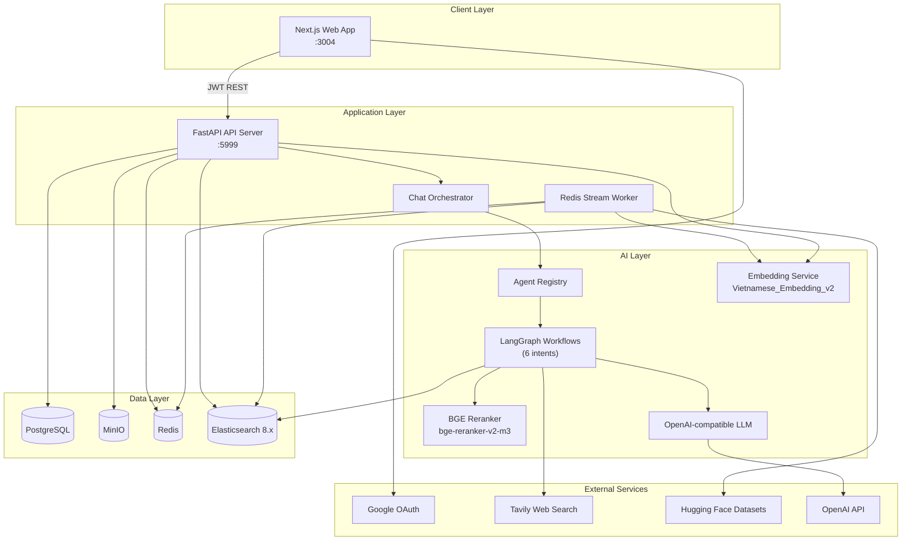

### Frontend

**Stack:** Next.js 16 (Pages Router), React 19, TanStack Query, Tailwind CSS 4, i18next (vi/en)

| Route | Purpose |
|-------|---------|
| `/chat` | Primary AI chat interface with citation panel, session history, file upload, HITL form fill |
| `/data-visualization` | Knowledge base management and legal corpus graph visualization (admin) |
| `/sign-in` | Google OAuth sign-in |
| `/auth/google/callback` | OAuth token exchange |

**Key modules:**
- `web/views/chat/` — Chat UI, message rendering, citation panel, contract draft preview
- `web/service/chatService.ts` — API client for `POST /v1/user/user_chat`
- `web/apis/endpoints.ts` — Backend URL mapping via `NEXT_PUBLIC_API_SERVER`

### Backend

**Stack:** FastAPI, Uvicorn, Peewee ORM, Pydantic v2

**Entry point:** `api/lex_companion_server.py` — factory `create_app()` auto-loads routers from `api/apps/routers/`.

**Layered architecture** (Inferred from implementation):

```
Router → Controller → Service → DB / ES / MinIO / Agent Registry
```

**Background worker:** `api/worker/task_execution.py` consumes Redis Streams for document parsing and Pháp điển import jobs. Started in FastAPI lifespan when Redis is available.

### AI Components

| Component | Location | Role |
|-----------|----------|------|
| **Intent Router** | `api/apps/services/orchestration/intent_router.py` | LLM classifies user query into 6 intents |
| **Chat Orchestrator** | `api/apps/services/orchestration/chat_orchestrator.py` | Routes to appropriate LangGraph workflow |
| **Agent Registry** | `deepagent/multiagent/legal_assistant/registry.py` | Caches and invokes intent-specific graphs |
| **Retrieval Service** | `api/apps/services/retrieval/service.py` | ES hybrid search → rerank → LLM answer |
| **Reranker** | `deepagent/core/rerank/rerank.py` | FlagEmbedding `BAAI/bge-reranker-v2-m3` |
| **Query Rewriting** | `deepagent/core/query_rewriting/rewrite.py` | Intent resolution + RAG query expansion |
| **HITL Assessment** | `deepagent/core/hitl/hitl.py` | Context sufficiency checks for clarification |

### Databases

| Store | Technology | Purpose |
|-------|------------|---------|
| **PostgreSQL** | Peewee ORM | Users, tenants, KB, chat sessions, legal corpus metadata |
| **Elasticsearch** | ES 8.13 | Vector + keyword indices: `lex_chunks_v1`, `user_documents` |
| **MinIO** | S3-compatible | File blobs, contract draft DOCX versions |
| **Redis** | Valkey client | Task queue (Redis Streams) for async indexing |

### Search Infrastructure

**Hybrid search** is implemented in `api/utils/elastic_chunk_index.py` via `LexChunkSearch`:

- **Keyword:** `multi_match` with field boosts (`article_title^8`, `subject_title^6`, `topic_title^5`, `content_text^2`)
- **Semantic:** KNN on `content_vector` (1024 dims, `AITeamVN/Vietnamese_Embedding_v2`)
- **Fusion:** Configurable `keyword_weight` (default 0.3) + semantic weight (0.7)
- **Post-filter:** Similarity threshold (default 0.5), topic/subject ID filters
- **Rerank:** Top candidates (default 100) → BGE reranker → final top-k (default 5)

### External Services

| Service | Usage |
|---------|-------|
| **OpenAI API** | Primary LLM for chat, retrieval answers, intent routing, metadata extraction |
| **Google OAuth** | User authentication |
| **Tavily** | Web search fallback when RAG context is insufficient |
| **Hugging Face Datasets** | Pháp điển import (`tmquan/phapdien-moj-gov-vn`) |
| **Vietnamese Embedding v2** | Self-hosted OpenAI-compatible embedding API (optional) |
| **Ollama / Phi3** | Optional self-hosted LLM proxy (Inferred from implementation) |

---

## Request Lifecycle

### End-to-End Chat Flow

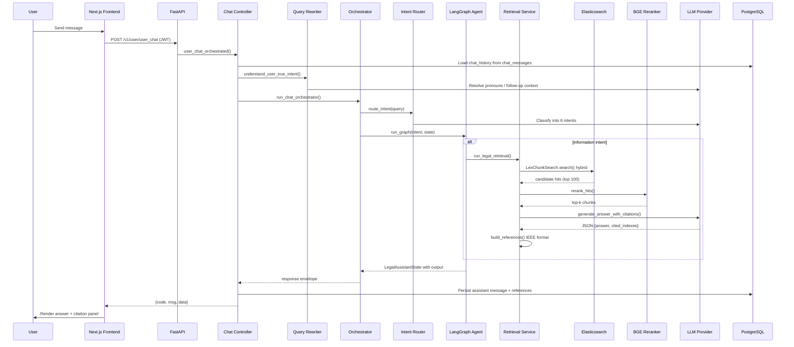

### Request Processing Stages

| Stage | Component | Description |
|-------|-----------|-------------|
| **1. Authentication** | `jwt_auth.py` | Bearer JWT → user lookup in PostgreSQL |
| **2. History Load** | `chat_controller.py` | Load prior messages for session context |
| **3. Intent Resolution** | `rewrite.py` | Rewrite follow-up queries using chat history |
| **4. Intent Routing** | `intent_router.py` | LLM classifies: information, decision, task_execution, problem_solving, exploration, communication_normal |
| **5. Graph Execution** | `registry.py` | Invoke intent-specific LangGraph workflow |
| **6. Retrieval** | `retrieval/service.py` | Hybrid ES search + rerank (when applicable) |
| **7. Reasoning** | Graph nodes | Context sufficiency check, retry, web fallback, HITL |
| **8. Citation Build** | `citations.py` | IEEE references for cited chunks only |
| **9. Persistence** | `chat_service.py` | Save assistant message with `references` JSON |
| **10. Response** | Router | Standard envelope `{code, msg, data}` |

---

## AI Agent Workflow

### Intent Taxonomy

Six intents defined in `deepagent/multiagent/legal_assistant/shared/state.py`:

| Intent | Graph | Primary Capability |
|--------|-------|-------------------|
| `information` | `information/graph.py` | RAG with retry loop, web fallback, HITL clarification |
| `decision` | `decision/graph.py` | Legal decision guidance with retrieval + fine estimation |
| `problem_solving` | `problem_solving/graph.py` | Structured problem analysis with retrieval |
| `exploration` | `exploration/graph.py` | Open-ended legal exploration (retrieval + web + calculators) |
| `task_execution` | `task_execution/graph.py` | Contract template fill with HITL checkpoint |
| `communication_normal` | `communication_normal/graph.py` | Social/conversational responses (no RAG) |

### Agent Registry

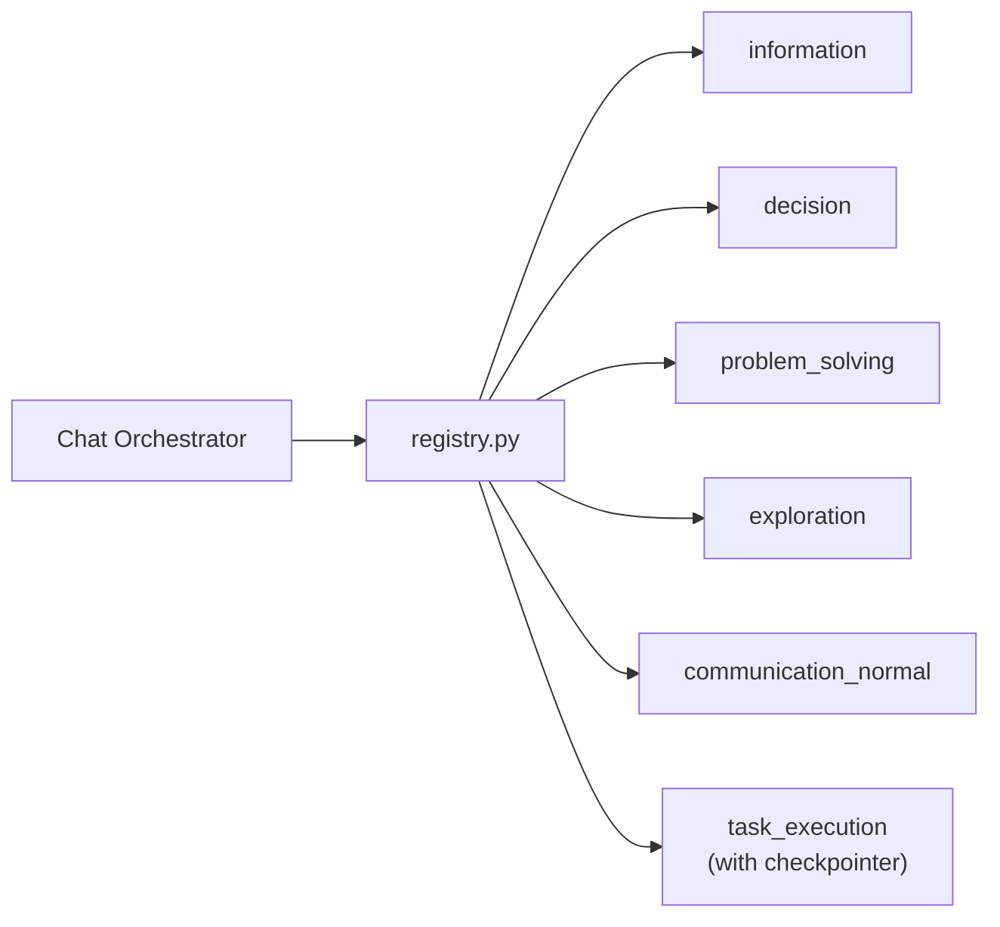

Graphs are cached after first compilation. Only `task_execution` uses a LangGraph checkpointer (`InMemorySaver`).

### Information Graph (Primary RAG Workflow)

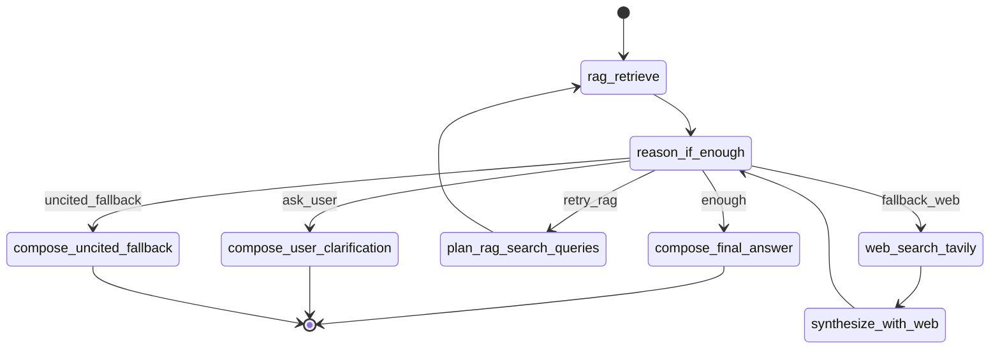

**Routing logic** (`route_after_reason` in `information/nodes.py`):
- **enough** — Retrieved context is sufficient; compose cited answer
- **ask_user** — Legal basis exists but user facts are missing; ask clarification
- **retry_rag** — Insufficient context, iteration < 2; expand queries via ontology
- **fallback_web** — RAG exhausted; search Tavily
- **uncited_fallback** — Web also insufficient; general knowledge answer without citations

### Tool Usage

Tools are **not** LangChain ReAct tools. They are invoked directly in graph nodes via a registry:

| Tool | File | Allowed Intents |
|------|------|-----------------|
| `legal_retrieval` | `tools/legal_retrieval.py` | information, decision, problem_solving, exploration, task_execution |
| `web_search` | `tools/web_search.py` | exploration (+ information fallback) |
| `calculators` | `tools/calculators.py` | decision, problem_solving, exploration (placeholder) |
| `document_tools` | `tools/document_tools.py` | task_execution (legacy stub; real logic in `contract_tools.py`) |

Policy defined in `tools/policies.py`.

### State Management

**`LegalAssistantState`** (`shared/state.py`) is a TypedDict carrying:

- **Query context:** `user_query`, `resolved_user_request`, `chat_history`, `intent`, `confidence`
- **Retrieval:** `retrieval_payload`, `citations`, `rag_search_queries`, `rag_iteration`, `retrieval_attempts`
- **Reasoning:** `is_context_sufficient`, `needs_user_clarification`, `missing_facts`, `reason_phase`
- **Web fallback:** `web_search_used`, `web_results`
- **Task execution:** `form_schema`, `filled_values`, `template_chunks`, `hitl_groups`, `working_docx_bytes`
- **Session:** `session_id`, `user_id`, `doc_ids`, `thread_id`, `reranker`

### Memory Layers

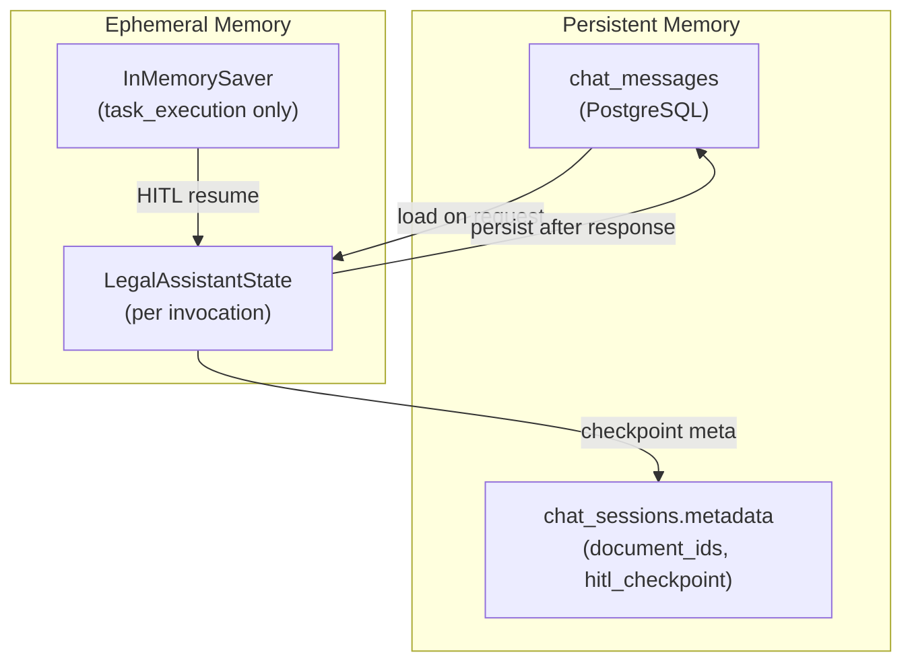

| Layer | Mechanism | Scope |
|-------|-----------|-------|
| **Conversation history** | PostgreSQL `chat_messages` | Cross-turn, per session |
| **Intent resolution** | LLM rewrite with history | Per request |
| **Graph checkpoint** | `InMemorySaver` (singleton) | task_execution HITL only; lost on restart |
| **Session metadata** | `chat_sessions.metadata` JSON | Document IDs, retrieval strategy, HITL state |
| **Token budget** | `RETRIEVAL_CONTEXT_MAX_TOKENS` | Truncates context when exceeded |

> **Note:** Redis/Postgres checkpointer factories exist as scaffolds in `deepagent/core/check_pointers/base.py` but are not implemented. Production uses in-memory checkpointing.

### Task Execution Graph (Contract Fill)

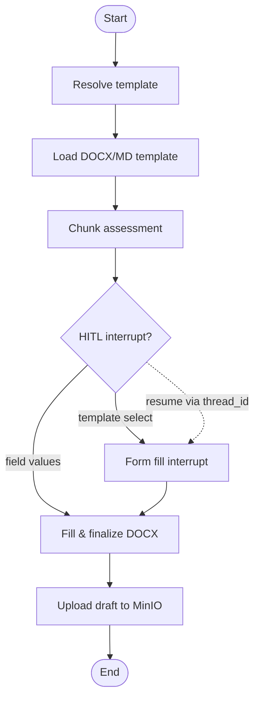

HITL uses `langgraph.types.interrupt` and resumes via `Command(resume=...)`. Thread ID format: `{user_id}:{session_id}:{intent}`.

---

## RAG Architecture

### Pipeline Overview

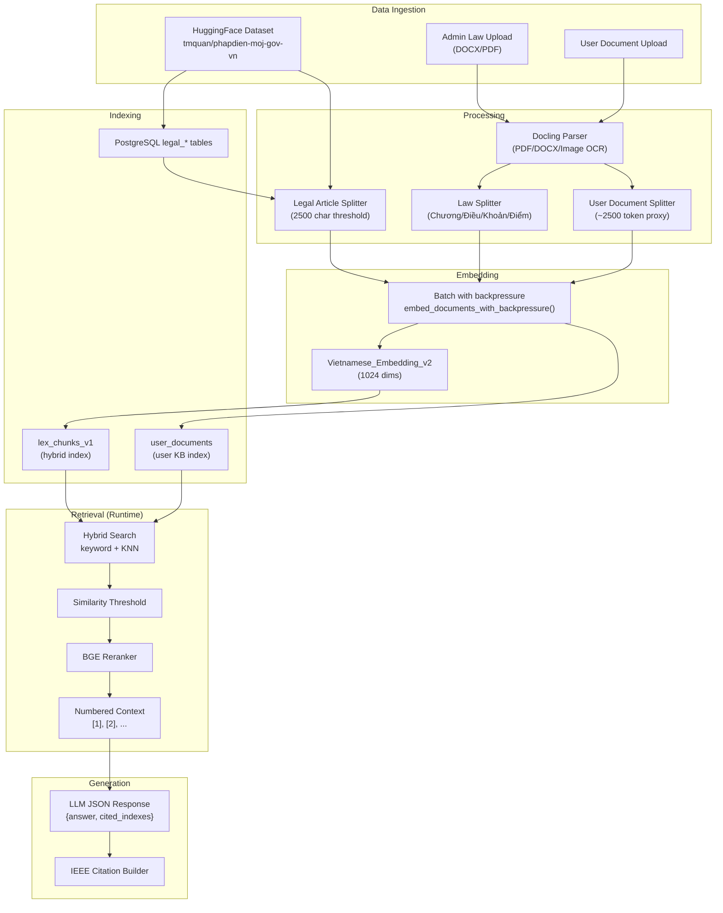

### Data Ingestion Paths

#### Path A: Pháp điển (Legal Codex)

1. Admin triggers import via `POST /v1/admin/doc/upload`
2. `hf_dataset_service.py` loads `tmquan/phapdien-moj-gov-vn` (6 configs) into PostgreSQL
3. Redis worker runs `sync_phapdien_postgres_to_elasticsearch`
4. `legal_article_split.py` chunks articles (>2500 chars → sliding window, 400 char overlap)
5. Embeddings batched via `embed_documents_with_backpressure()`
6. Bulk indexed into `lex_chunks_v1`

#### Path B: Admin Law Document Upload

1. Docling converts PDF/DOCX to markdown
2. `law_split.py` parses Vietnamese legal structure (Chương → Điều → Khoản → Điểm)
3. LLM extracts `based_on` / `implements` metadata from preface
4. Chunks bulk-indexed with vectors

#### Path C: User Document Upload

1. User uploads via `POST /v1/doc/upload` or chat session upload
2. File stored in MinIO; metadata in PostgreSQL
3. Parse job enqueued to Redis (`POST /v1/doc/run`)
4. `user_document_split.py` chunks (~2500 token proxy, 400 overlap)
5. Indexed into `user_documents` ES index

> **Note:** User document parse worker (`document_parse.py`) is partially implemented — the Redis job trigger exists but full Docling pipeline for user docs is a stub (Inferred from implementation).

### Chunking Strategies

| Splitter | File | Strategy |
|----------|------|----------|
| Legal articles | `legal_article_split.py` | 2500 char threshold; sliding window 2400–2600, overlap 400 |
| Law documents | `law_split.py` | Regex hierarchy parsing + LLM metadata extraction |
| User documents | `user_document_split.py` | Token-proportional chunks (~2500 tokens, 400 overlap) |

### Embedding

- **Model:** `AITeamVN/Vietnamese_Embedding_v2` (1024 dimensions)
- **Provider factory:** `deepagent/core/providers/embeddings/base.py` (OpenAI-compatible / localai)
- **Self-hosted service:** `model_serving/embeddings/vie_embedding_v2/app.py`
- **Resilience:** Per-item fallback on partial batch responses; rate-limit retry with backoff

### Hybrid Retrieval

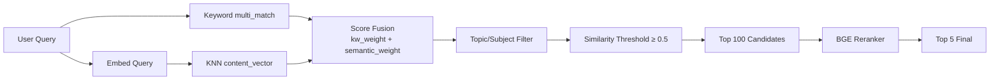

**Default parameters** (configurable per request):
- `candidate_size`: 100
- `similarity_threshold`: 0.5
- `keyword_weight`: 0.3
- `final_size`: 5

**Multi-query retry:** `admin_retrieve_and_answer_multi` merges hits from expanded queries, deduplicates by `chunk_id`, reranks once.

### Reranking

- **Model:** `BAAI/bge-reranker-v2-m3` via FlagEmbedding
- **Preloaded** at API startup when `RERANK_ENABLED=true`
- **Input:** Query + chunk `content_text` with title prefixes
- **Output:** Top-k reranked hits with `rerank_score`

### Citation Generation

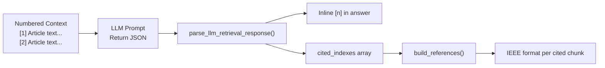

**Legal citation format** (`citations.py`):
```
[n] topic_title, subject_title, article_title, chapter_title — source_link
```

**Web citation format:**
```
[n] title — URL (source_type: "web")
```

Only chunks whose index appears in `cited_indexes` are returned in the `reference` array.

---

## Database Design

### Entity-Relationship Diagram

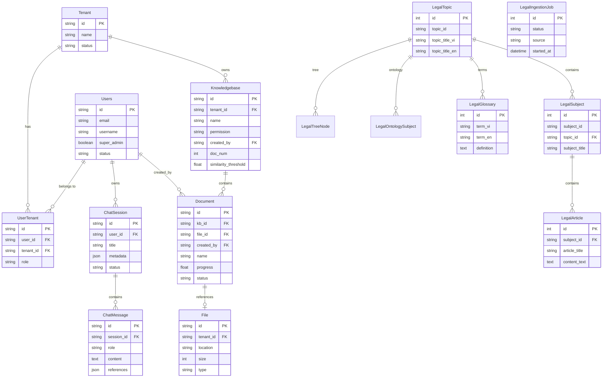

### Ownership Boundaries

| Domain | Owner | Storage |
|--------|-------|---------|
| **User identity** | Auth service | PostgreSQL `users`, `tenants`, `user_tenants` |
| **Chat sessions** | Chat service | PostgreSQL `chat_sessions`, `chat_messages` |
| **User KB** | Document service | PostgreSQL metadata + MinIO blobs + ES `user_documents` |
| **Legal corpus** | Admin service | PostgreSQL `legal_*` + ES `lex_chunks_v1` |
| **Contract drafts** | Task execution | MinIO (versioned DOCX) + session metadata |
| **Task queue** | Worker | Redis Streams |

### Elasticsearch Indices

| Index | Env Variable | Key Fields |
|-------|-------------|------------|
| `lex_chunks_v1` | `LEX_CHUNKS_INDEX` | `article_id`, `topic_id`, `subject_id`, `content_text`, `content_vector`, `source_link`, `order`, `parent_chunk_id` |
| `user_documents` | `USER_DOCUMENTS_INDEX` | `chunk_id`, `user_id`, `kb_id`, `document_id`, `content_text`, `content_vector` |

Schema reference: `api/db/elastic_index.json`

---

## API Documentation

All endpoints return a standard envelope: `{ "code": int, "msg": string, "data": object }`.

Authentication: Bearer JWT via `Authorization` header (except OAuth login).

### Authentication

| Method | Path | Auth | Purpose |
|--------|------|------|---------|
| `POST` | `/v1/user/oAuth-login` | None | Exchange Google OAuth code for JWT; auto-provision user/tenant/KB |

**Input:** `{ "code": "google_oauth_code" }`  
**Output:** `{ "token": "jwt...", "user": { id, email, role, ... } }`

### User Chat & Sessions

| Method | Path | Auth | Purpose |
|--------|------|------|---------|
| `POST` | `/v1/user/user_chat` | JWT | **Primary chat endpoint** — intent routing + LangGraph orchestrator |
| `POST` | `/v1/user/chat` | JWT + super_admin | Direct retrieval (bypasses orchestrator) |
| `GET` | `/v1/user/sessions` | JWT | List chat sessions (paginated) |
| `GET` | `/v1/user/session` | JWT | Get session with messages |
| `DELETE` | `/v1/user/chat` | JWT | Soft-delete chat session |
| `POST` | `/v1/user/upload` | JWT | Upload file to chat session (PDF/DOCX/image) |

**`POST /v1/user/user_chat` Input:**
```json
{
  "query": "string",
  "session_id": "string",
  "thread_id": "string (optional, HITL resume)",
  "resume": { "action": "string", "payload": {} },
  "ui_template": "task_execution (optional, skip intent routing)",
  "topic_ids": ["string"],
  "subject_ids": ["string"],
  "candidate_size": 100,
  "similarity_threshold": 0.5,
  "final_size": 5,
  "keyword_weight": 0.3
}
```

**Output:**
```json
{
  "code": 0,
  "data": {
    "answer": "string with [1] inline citations",
    "reference": [{ "ieee": "string", "score": 0.9, "metadata": {} }],
    "intent": "information",
    "answer_mode": "grounded",
    "status": "completed | waiting_human",
    "hitl": { "kind": "form_fill", "form_schema": {} }
  }
}
```

### Contract Fill / Draft

| Method | Path | Auth | Purpose |
|--------|------|------|---------|
| `POST` | `/v1/user/contract/fill` | JWT | Contract fill (JSON or SSE if `stream=true`) |
| `GET` | `/v1/user/contract/draft/preview` | JWT | Markdown draft preview |
| `GET` | `/v1/user/contract/draft/versions` | JWT | List DOCX versions on MinIO |
| `GET` | `/v1/user/contract/draft/preview/binary` | JWT | Inline DOCX binary |
| `GET` | `/v1/user/contract/draft/preview/html` | JWT | HTML preview from DOCX |
| `GET` | `/v1/user/contract/draft` | JWT | Download DOCX draft |

### Documents / Knowledge Base

| Method | Path | Auth | Purpose |
|--------|------|------|---------|
| `GET` | `/v1/docs` | JWT | List KB documents (paginated) |
| `POST` | `/v1/doc/upload` | JWT | Upload file to KB |
| `POST` | `/v1/doc/upload_via_url` | JWT | Crawl URL → PDF → upload |
| `GET` | `/v1/doc/content` | JWT | Stream file blob from MinIO |
| `GET` | `/v1/doc` | JWT | Presigned URL for document |
| `DELETE` | `/v1/doc` | JWT | Soft-delete document (owner only) |
| `POST` | `/v1/doc/run` | JWT | Enqueue parse/embedding job |

### Admin Legal Corpus

| Method | Path | Auth | Purpose |
|--------|------|------|---------|
| `GET` | `/v1/admin/doc/topic` | JWT + super_admin | List/detail legal topics |
| `GET` | `/v1/admin/doc/subject` | JWT + super_admin | List/detail legal subjects |
| `GET` | `/v1/admin/doc/articles` | JWT + super_admin | Articles by subject |
| `POST` | `/v1/admin/doc/retrieval` | JWT + super_admin | Direct ES search → rerank → LLM |
| `POST` | `/v1/admin/doc/upload` | JWT + super_admin | Import HuggingFace Pháp điển dataset |

### Model Serving (Standalone)

| Service | Endpoints | Port |
|---------|-----------|------|
| Vietnamese Embedding v2 | `GET /health`, `POST /v1/embeddings` | 6501 |
| Phi3 LLM Proxy | `GET /health`, `POST /v1/chat/completions` | 8000 |

---

## Deployment Architecture

### Docker Compose Stack

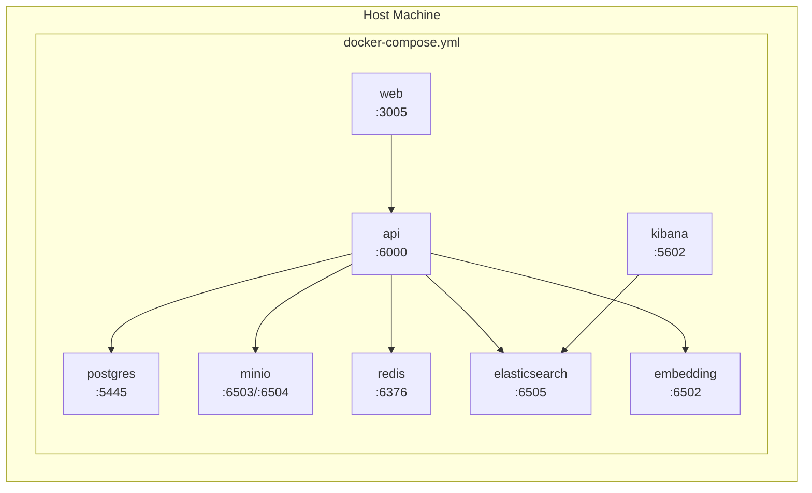

**Start command:**
```bash
cp .env.example .env
docker compose -f docker/docker-compose.yml up -d --build
```

### Service Map

| Service | Container | Host Port | Internal Port | Health Check |
|---------|-----------|-----------|---------------|--------------|
| PostgreSQL | `lex-postgres` | 5445 | 5432 | `pg_isready` |
| MinIO | `lex-minio` | 6503/6504 | 9000/9001 | `/minio/health/live` |
| Redis | `lex-redis` | 6376 | 6379 | `redis-cli ping` |
| Elasticsearch | `lex-elasticsearch` | 6505 | 9200 | cluster health |
| Kibana | `lex-kibana` | 5602 | 5601 | `/api/status` |
| Embedding | `lex-embedding` | 6502 | 6501 | `/health` |
| API | `lex-api` | 6000 | 5999 | `/openapi.json` |
| Web | `lex-web` | 3005 | 3004 | `/` |

### Environment Variables

Critical variables (see `.env.example` for full list):

| Group | Variables | Required |
|-------|-----------|----------|
| **Database** | `POSTGRES_USER`, `POSTGRES_PASSWORD`, `POSTGRES_DB`, `POSTGRES_HOST`, `POSTGRES_PORT` | Yes |
| **Object Storage** | `MINIO_HOST`, `MINIO_USER`, `MINIO_PASSWORD`, `MINIO_BUCKET` | Yes |
| **Search** | `ELASTIC_HOST`, `ELASTIC_PASSWORD`, `LEX_CHUNKS_INDEX`, `LEGAL_VECTOR_DIMS` | Yes |
| **LLM** | `OPENAI_API_KEY`, `OPENAI_BASE_URL`, `LLM_MODEL` | Yes |
| **Embedding** | `EMBEDDING_PROVIDER`, `EMBEDDING_BASE_URL`, `EMBEDDING_MODEL` | Yes |
| **Auth** | `JWT_SECRET_KEY`, `GOOGLE_CLIENT_ID`, `GOOGLE_CLIENT_SECRET` | Yes |
| **Redis** | `REDIS_HOST`, `REDIS_PORT`, `REDIS_PASSWORD` | Optional (worker disabled without) |
| **Rerank** | `RERANK_ENABLED`, `RERANK_MODEL_NAME` | Recommended |
| **Web Search** | `TAVILY_API_KEY` | Optional (fallback disabled without) |
| **Frontend** | `NEXT_PUBLIC_API_SERVER`, `NEXT_PUBLIC_GOOGLE_CLIENT_ID` | Yes (build-time) |

Docker internal overrides: `docker/docker-compose.env` remaps hostnames to container service names.

### Production Deployment Notes

1. **No CI/CD pipeline** is configured in the repository (Inferred from implementation). Deployment is manual via Docker Compose.

2. **Elasticsearch** requires `vm.max_map_count=262144` on Linux hosts.

3. **Embedding service** has a long startup period (~5 min) due to model loading; API depends on embedding health.

4. **Reranker** loads at API startup — first request may be slow; GPU recommended via `RERANK_DEVICE=cuda:0`.

5. **Checkpointer** uses `InMemorySaver` — HITL state is lost on API restart. Production should implement Redis/Postgres checkpointer (scaffold exists).

6. **Separate venvs:** Root `.venv` for API; `model_serving/` services may have independent GPU venvs.

### Networking

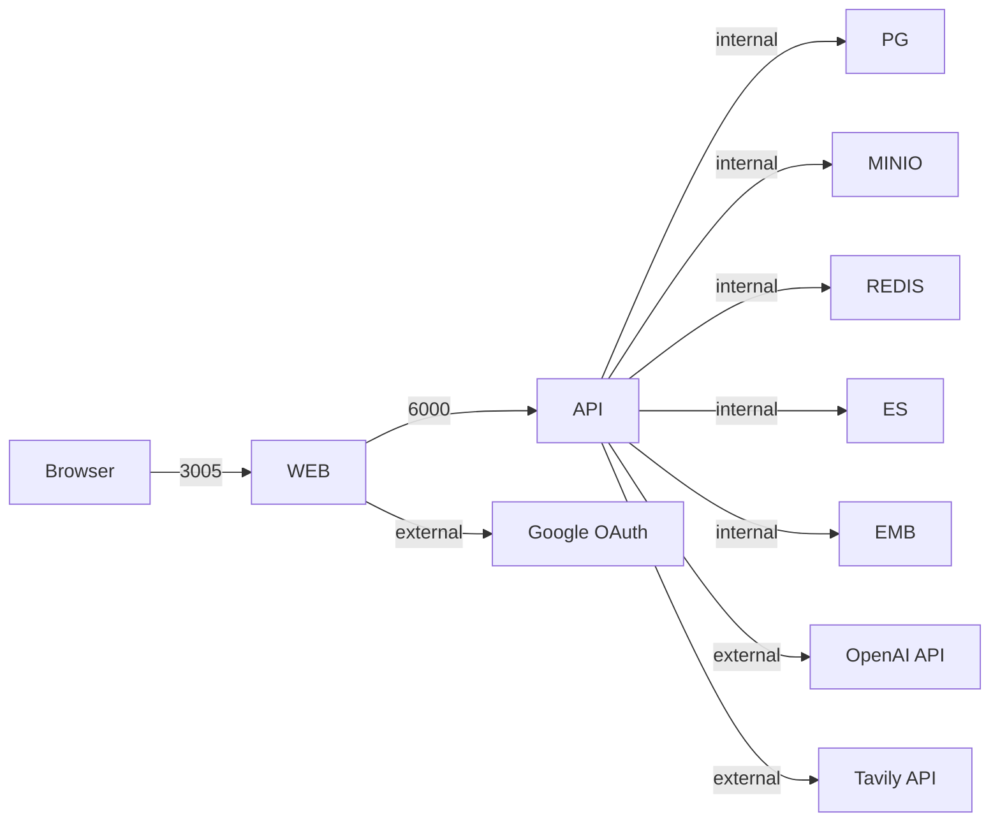

In Docker Compose, inter-service communication uses container names (e.g., `postgres`, `elasticsearch`). The API container reads `docker-compose.env` to override localhost hostnames.

---

## Appendix: Technology Stack Summary

| Layer | Technologies |
|-------|-------------|
| **Frontend** | Next.js 16, React 19, TanStack Query, Tailwind CSS 4, i18next |
| **Backend** | FastAPI, Uvicorn, Peewee, Pydantic v2, Loguru |
| **AI/Agent** | LangGraph, LangChain, FlagEmbedding |
| **Search** | Elasticsearch 8.13, hybrid keyword + KNN |
| **Embedding** | AITeamVN/Vietnamese_Embedding_v2 (1024d) |
| **Reranking** | BAAI/bge-reranker-v2-m3 |
| **LLM** | OpenAI-compatible (GPT-4 class) |
| **Document** | Docling, PyMuPDF, python-docx, WeasyPrint |
| **Storage** | PostgreSQL, MinIO, Redis |
| **Package Manager** | uv (Python), npm (Frontend) |
| **Containerization** | Docker Compose |

---

*Generated from codebase analysis. Last updated: June 2026.*
