# Lex Companion — Kiến trúc kỹ thuật

> **Lex Companion** là trợ lý AI pháp luật Việt Nam xây dựng trên LangGraph, FastAPI và Elasticsearch hybrid search. Tài liệu này mô tả cách hệ thống thực sự hoạt động, suy luận từ implementation.

<p align="right">
  <a href="ARCHITECTURE.md">English</a>
</p>

---

## Mục lục

1. [Tóm tắt điều hành](#tóm-tắt-điều-hành)
2. [Kiến trúc hệ thống](#kiến-trúc-hệ-thống)
3. [Vòng đời request](#vòng-đời-request)
4. [Luồng AI Agent](#luồng-ai-agent)
5. [Kiến trúc RAG](#kiến-trúc-rag)
6. [Thiết kế database](#thiết-kế-database)
7. [Tài liệu API](#tài-liệu-api)
8. [Kiến trúc triển khai](#kiến-trúc-triển-khai)

---

## Tóm tắt điều hành

### Vấn đề cần giải quyết

Luật sư và công dân Việt Nam cần truy cập đáng tin cậy vào **Pháp điển** và tri thức pháp luật liên quan. Văn bản pháp luật thô thường dày đặc, phân cấp và khó tìm kiếm. Chatbot LLM thông thường bịa trích dẫn và không thể truy vết câu trả lời về nguồn có thẩm quyền.

Lex Companion giải quyết bằng cách kết hợp **retrieval-augmented generation (RAG)** trên corpus pháp luật được chuẩn hóa với **luồng agent đa intent** — định tuyến yêu cầu người dùng tới các nhánh suy luận chuyên biệt, từ hỏi đáp pháp luật đến soạn hợp đồng với checkpoint human-in-the-loop (HITL).

### Đối tượng người dùng

| Loại người dùng | Use case chính |
| --------------- | -------------- |
| **Chuyên gia pháp luật** | Nghiên cứu pháp luật, câu trả lời có trích dẫn, soạn thảo văn bản |
| **Công dân / SME** | Hỏi đáp pháp luật, hướng dẫn quyết định, điền mẫu hợp đồng |
| **Quản trị viên** | Nạp corpus pháp luật, index Elasticsearch, tinh chỉnh truy xuất |

### Tính năng chính

- **Hỏi đáp pháp luật** — Hybrid ES search + reranking + LLM với trích dẫn `[n]` inline và tham chiếu kiểu IEEE
- **Nghiên cứu pháp luật** — RAG retry đa truy vấn với mở rộng truy vấn theo ontology
- **Truy xuất tri thức pháp luật** — Corpus Pháp điển (~64k điều) index trong Elasticsearch với dense vectors
- **Sinh văn bản pháp luật** — Luồng task-execution LangGraph: chọn mẫu hợp đồng, điền form, xuất DOCX
- **Phản hồi có trích dẫn** — Chỉ nguồn được cite xuất hiện trong panel tham chiếu; web fallback dùng Tavily với format trích dẫn riêng
- **Knowledge Base người dùng** — Upload tài liệu, chunking và truy xuất theo phiên
- **Human-in-the-Loop** — Luồng điền hợp đồng có checkpoint, resume qua `thread_id`

### Giá trị cốt lõi

Lex Companion cung cấp **câu trả lời pháp luật có căn cứ, truy vết được** bằng cách kết hợp pipeline hybrid search production-grade (keyword + semantic + rerank) với LangGraph agent theo intent — thay vì một chatbot đơn khối. Mọi luận điểm thực tế có thể truy về điều Pháp điển, tài liệu người dùng upload, hoặc (fallback) nguồn web.

---

## Kiến trúc hệ thống

### Tổng quan cấp cao

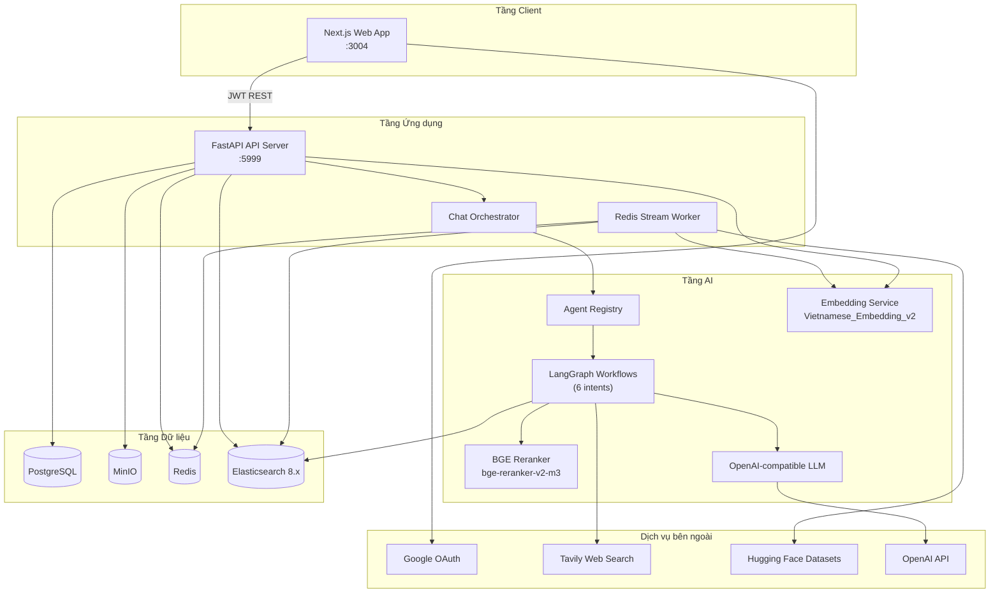

### Frontend

**Stack:** Next.js 16 (Pages Router), React 19, TanStack Query, Tailwind CSS 4, i18next (vi/en)

| Route | Mục đích |
| ----- | -------- |
| `/chat` | Giao diện chat AI chính: panel trích dẫn, lịch sử phiên, upload file, HITL form fill |
| `/data-visualization` | Quản lý knowledge base và trực quan hóa đồ thị corpus pháp luật (admin) |
| `/sign-in` | Đăng nhập Google OAuth |
| `/auth/google/callback` | Trao đổi token OAuth |

**Module chính:**
- `web/views/chat/` — UI chat, render tin nhắn, panel trích dẫn, preview bản nháp hợp đồng
- `web/service/chatService.ts` — API client cho `POST /v1/user/user_chat`
- `web/apis/endpoints.ts` — Mapping URL backend qua `NEXT_PUBLIC_API_SERVER`

### Backend

**Stack:** FastAPI, Uvicorn, Peewee ORM, Pydantic v2

**Entry point:** `api/lex_companion_server.py` — factory `create_app()` tự động load routers từ `api/apps/routers/`.

**Kiến trúc phân lớp** *(suy luận từ implementation)*:

```
Router → Controller → Service → DB / ES / MinIO / Agent Registry
```

**Background worker:** `api/worker/task_execution.py` consume Redis Streams cho parse tài liệu và import Pháp điển. Khởi động trong FastAPI lifespan khi Redis khả dụng.

### Thành phần AI

| Thành phần | Vị trí | Vai trò |
| ---------- | ------ | ------- |
| **Intent Router** | `api/apps/services/orchestration/intent_router.py` | LLM phân loại truy vấn thành 6 intent |
| **Chat Orchestrator** | `api/apps/services/orchestration/chat_orchestrator.py` | Định tuyến tới LangGraph workflow phù hợp |
| **Agent Registry** | `deepagent/multiagent/legal_assistant/registry.py` | Cache và gọi graph theo intent |
| **Retrieval Service** | `api/apps/services/retrieval/service.py` | ES hybrid search → rerank → LLM answer |
| **Reranker** | `deepagent/core/rerank/rerank.py` | FlagEmbedding `BAAI/bge-reranker-v2-m3` |
| **Query Rewriting** | `deepagent/core/query_rewriting/rewrite.py` | Giải quyết intent + mở rộng truy vấn RAG |
| **HITL Assessment** | `deepagent/core/hitl/hitl.py` | Kiểm tra đủ ngữ cảnh để làm rõ với user |

### Database

| Kho | Công nghệ | Mục đích |
| --- | --------- | -------- |
| **PostgreSQL** | Peewee ORM | Users, tenants, KB, phiên chat, metadata corpus pháp luật |
| **Elasticsearch** | ES 8.13 | Index vector + keyword: `lex_chunks_v1`, `user_documents` |
| **MinIO** | S3-compatible | File blob, phiên bản DOCX bản nháp hợp đồng |
| **Redis** | Valkey client | Hàng đợi task (Redis Streams) cho index async |

### Hạ tầng tìm kiếm

**Hybrid search** được triển khai trong `api/utils/elastic_chunk_index.py` qua `LexChunkSearch`:

- **Keyword:** `multi_match` với field boost (`article_title^8`, `subject_title^6`, `topic_title^5`, `content_text^2`)
- **Semantic:** KNN trên `content_vector` (1024 dims, `AITeamVN/Vietnamese_Embedding_v2`)
- **Fusion:** `keyword_weight` cấu hình được (mặc định 0.3) + semantic weight (0.7)
- **Post-filter:** Ngưỡng similarity (mặc định 0.5), filter topic/subject ID
- **Rerank:** Top candidates (mặc định 100) → BGE reranker → top-k cuối (mặc định 5)

### Dịch vụ bên ngoài

| Dịch vụ | Sử dụng |
| ------- | ------- |
| **OpenAI API** | LLM chính cho chat, câu trả lời retrieval, intent routing, trích metadata |
| **Google OAuth** | Xác thực người dùng |
| **Tavily** | Web search fallback khi ngữ cảnh RAG không đủ |
| **Hugging Face Datasets** | Import Pháp điển (`tmquan/phapdien-moj-gov-vn`) |
| **Vietnamese Embedding v2** | API embedding self-hosted tương thích OpenAI (tùy chọn) |
| **Ollama / Phi3** | Proxy LLM self-hosted tùy chọn *(suy luận từ implementation)* |

---

## Vòng đời request

### Luồng chat end-to-end

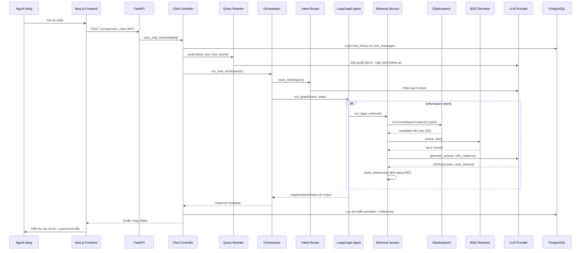

### Các giai đoạn xử lý request

| Giai đoạn | Thành phần | Mô tả |
| --------- | ---------- | ----- |
| **1. Xác thực** | `jwt_auth.py` | Bearer JWT → tra cứu user trong PostgreSQL |
| **2. Load lịch sử** | `chat_controller.py` | Load tin nhắn trước cho ngữ cảnh phiên |
| **3. Giải quyết intent** | `rewrite.py` | Viết lại truy vấn follow-up dùng lịch sử chat |
| **4. Định tuyến intent** | `intent_router.py` | LLM phân loại: information, decision, task_execution, problem_solving, exploration, communication_normal |
| **5. Thực thi graph** | `registry.py` | Gọi LangGraph workflow theo intent |
| **6. Truy xuất** | `retrieval/service.py` | Hybrid ES search + rerank (khi áp dụng) |
| **7. Suy luận** | Graph nodes | Kiểm tra đủ ngữ cảnh, retry, web fallback, HITL |
| **8. Xây dựng trích dẫn** | `citations.py` | Tham chiếu IEEE cho chunk đã cite |
| **9. Lưu trữ** | `chat_service.py` | Lưu tin nhắn assistant với JSON `references` |
| **10. Phản hồi** | Router | Envelope chuẩn `{code, msg, data}` |

---

## Luồng AI Agent

### Phân loại intent

Sáu intent được định nghĩa trong `deepagent/multiagent/legal_assistant/shared/state.py`:

| Intent | Graph | Khả năng chính |
| ------ | ----- | -------------- |
| `information` | `information/graph.py` | RAG với vòng retry, web fallback, HITL clarification |
| `decision` | `decision/graph.py` | Hướng dẫn quyết định pháp lý với retrieval + ước tính phạt |
| `problem_solving` | `problem_solving/graph.py` | Phân tích vấn đề có cấu trúc với retrieval |
| `exploration` | `exploration/graph.py` | Khám phá pháp luật mở (retrieval + web + calculators) |
| `task_execution` | `task_execution/graph.py` | Điền mẫu hợp đồng với checkpoint HITL |
| `communication_normal` | `communication_normal/graph.py` | Phản hồi xã giao/hội thoại (không RAG) |

### Agent Registry

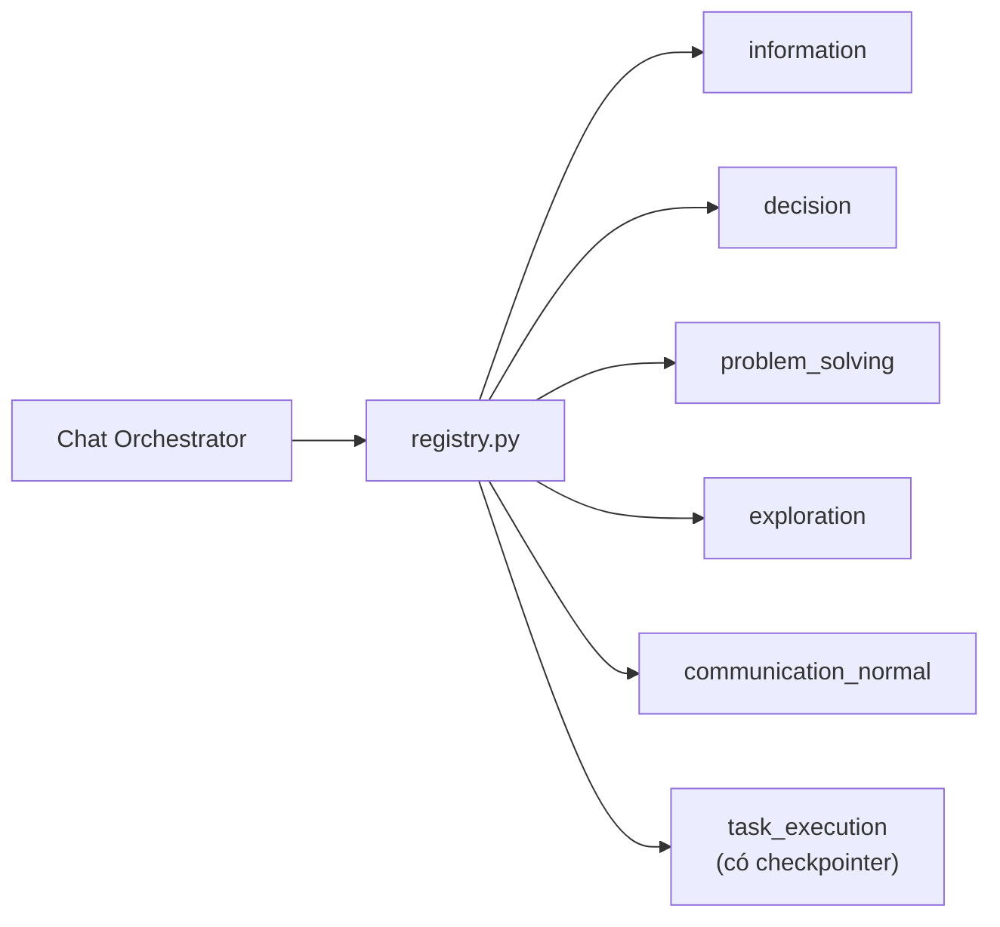

Graph được cache sau lần compile đầu. Chỉ `task_execution` dùng LangGraph checkpointer (`InMemorySaver`).

### Information Graph (Luồng RAG chính)

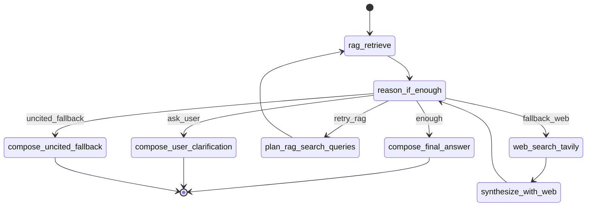

**Logic định tuyến** (`route_after_reason` trong `information/nodes.py`):
- **enough** — Ngữ cảnh truy xuất đủ; soạn câu trả lời có trích dẫn
- **ask_user** — Có cơ sở pháp lý nhưng thiếu sự kiện từ user; hỏi làm rõ
- **retry_rag** — Ngữ cảnh không đủ, iteration < 2; mở rộng truy vấn qua ontology
- **fallback_web** — RAG đã cạn; tìm Tavily
- **uncited_fallback** — Web cũng không đủ; câu trả lời kiến thức chung không trích dẫn

### Sử dụng tool

Tools **không** phải LangChain ReAct tools. Chúng được gọi trực tiếp trong graph nodes qua registry:

| Tool | File | Intent được phép |
| ---- | ---- | ---------------- |
| `legal_retrieval` | `tools/legal_retrieval.py` | information, decision, problem_solving, exploration, task_execution |
| `web_search` | `tools/web_search.py` | exploration (+ information fallback) |
| `calculators` | `tools/calculators.py` | decision, problem_solving, exploration (placeholder) |
| `document_tools` | `tools/document_tools.py` | task_execution (stub legacy; logic thực trong `contract_tools.py`) |

Chính sách định nghĩa trong `tools/policies.py`.

### Quản lý state

**`LegalAssistantState`** (`shared/state.py`) là TypedDict chứa:

- **Ngữ cảnh truy vấn:** `user_query`, `resolved_user_request`, `chat_history`, `intent`, `confidence`
- **Truy xuất:** `retrieval_payload`, `citations`, `rag_search_queries`, `rag_iteration`, `retrieval_attempts`
- **Suy luận:** `is_context_sufficient`, `needs_user_clarification`, `missing_facts`, `reason_phase`
- **Web fallback:** `web_search_used`, `web_results`
- **Task execution:** `form_schema`, `filled_values`, `template_chunks`, `hitl_groups`, `working_docx_bytes`
- **Phiên:** `session_id`, `user_id`, `doc_ids`, `thread_id`, `reranker`

### Các lớp bộ nhớ

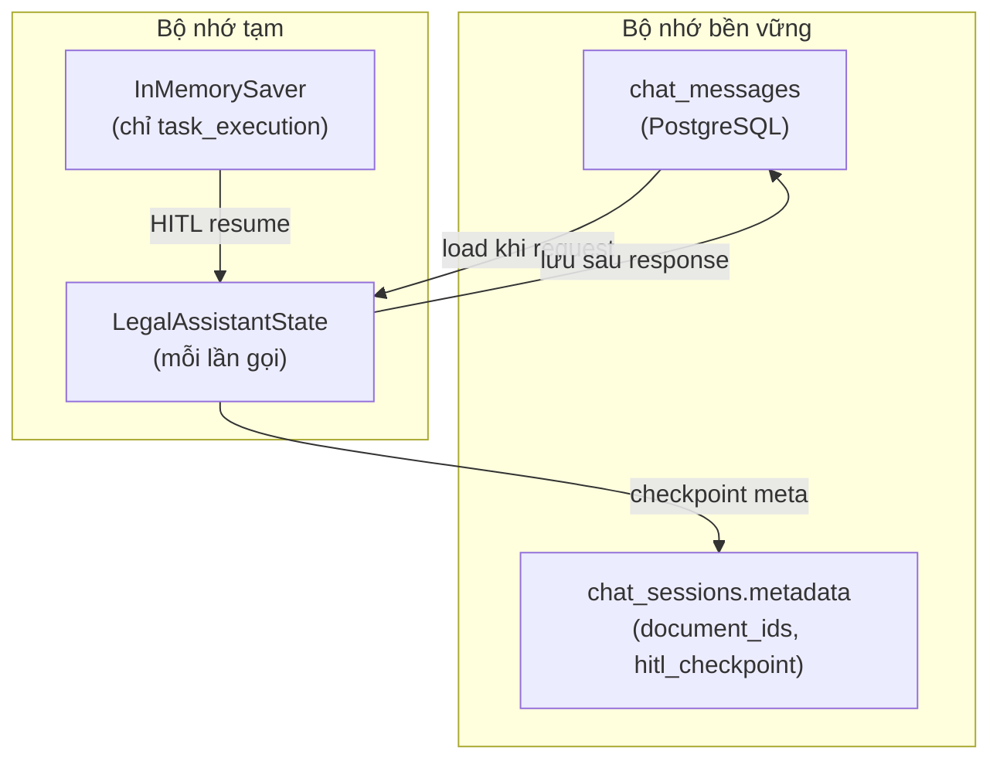

| Lớp | Cơ chế | Phạm vi |
| --- | ------ | ------- |
| **Lịch sử hội thoại** | PostgreSQL `chat_messages` | Xuyên turn, theo phiên |
| **Giải quyết intent** | LLM rewrite với lịch sử | Mỗi request |
| **Graph checkpoint** | `InMemorySaver` (singleton) | Chỉ HITL task_execution; mất khi restart |
| **Metadata phiên** | JSON `chat_sessions.metadata` | Document IDs, chiến lược retrieval, trạng thái HITL |
| **Ngân sách token** | `RETRIEVAL_CONTEXT_MAX_TOKENS` | Cắt ngữ cảnh khi vượt ngưỡng |

> **Lưu ý:** Factory checkpointer Redis/Postgres tồn tại dạng scaffold trong `deepagent/core/check_pointers/base.py` nhưng chưa implement. Production dùng in-memory checkpointing.

### Task Execution Graph (Điền hợp đồng)

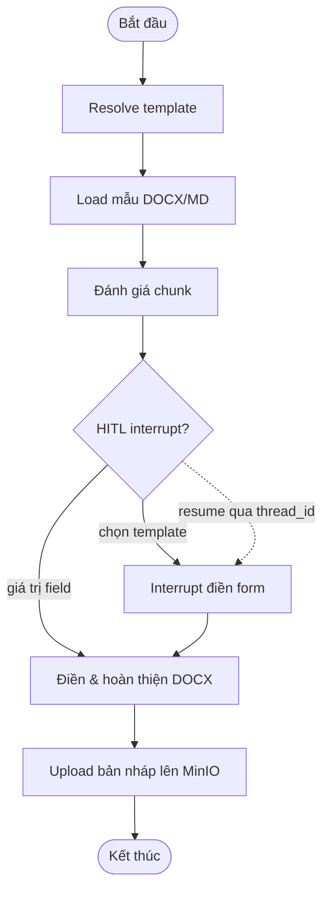

HITL dùng `langgraph.types.interrupt` và resume qua `Command(resume=...)`. Định dạng Thread ID: `{user_id}:{session_id}:{intent}`.

---

## Kiến trúc RAG

### Tổng quan pipeline

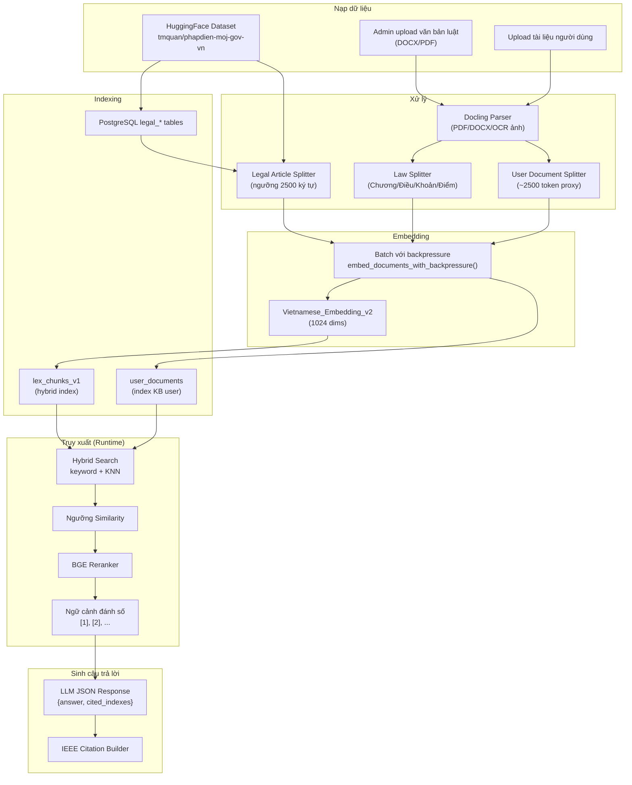

### Các đường nạp dữ liệu

#### Đường A: Pháp điển

1. Admin kích hoạt import qua `POST /v1/admin/doc/upload`
2. `hf_dataset_service.py` load `tmquan/phapdien-moj-gov-vn` (6 configs) vào PostgreSQL
3. Redis worker chạy `sync_phapdien_postgres_to_elasticsearch`
4. `legal_article_split.py` chunk điều luật (>2500 ký tự → sliding window, overlap 400 ký tự)
5. Embedding batch qua `embed_documents_with_backpressure()`
6. Bulk index vào `lex_chunks_v1`

#### Đường B: Admin upload văn bản luật

1. Docling chuyển PDF/DOCX sang markdown
2. `law_split.py` parse cấu trúc pháp luật Việt Nam (Chương → Điều → Khoản → Điểm)
3. LLM trích metadata `based_on` / `implements` từ phần mở đầu
4. Chunk bulk-index kèm vector

#### Đường C: Upload tài liệu người dùng

1. User upload qua `POST /v1/doc/upload` hoặc upload trong phiên chat
2. File lưu MinIO; metadata trong PostgreSQL
3. Job parse enqueue vào Redis (`POST /v1/doc/run`)
4. `user_document_split.py` chunk (~2500 token proxy, overlap 400)
5. Index vào ES index `user_documents`

> **Lưu ý:** Worker parse tài liệu user (`document_parse.py`) mới implement một phần — trigger job Redis đã có nhưng pipeline Docling đầy đủ cho user doc vẫn là stub *(suy luận từ implementation)*.

### Chiến lược chunking

| Splitter | File | Chiến lược |
| -------- | ---- | ---------- |
| Điều luật pháp điển | `legal_article_split.py` | Ngưỡng 2500 ký tự; sliding window 2400–2600, overlap 400 |
| Văn bản luật | `law_split.py` | Parse phân cấp regex + LLM trích metadata |
| Tài liệu user | `user_document_split.py` | Chunk theo tỷ lệ token (~2500 tokens, overlap 400) |

### Embedding

- **Model:** `AITeamVN/Vietnamese_Embedding_v2` (1024 chiều)
- **Provider factory:** `deepagent/core/providers/embeddings/base.py` (OpenAI-compatible / localai)
- **Dịch vụ self-hosted:** `model_serving/embeddings/vie_embedding_v2/app.py`
- **Khả năng chịu lỗi:** Fallback từng item khi batch trả về thiếu vector; retry rate-limit với backoff

### Truy xuất hybrid

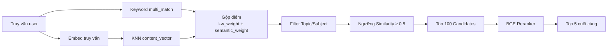

**Tham số mặc định** (cấu hình được mỗi request):
- `candidate_size`: 100
- `similarity_threshold`: 0.5
- `keyword_weight`: 0.3
- `final_size`: 5

**Retry đa truy vấn:** `admin_retrieve_and_answer_multi` gộp hits từ truy vấn mở rộng, dedupe theo `chunk_id`, rerank một lần.

### Reranking

- **Model:** `BAAI/bge-reranker-v2-m3` qua FlagEmbedding
- **Preload** lúc API startup khi `RERANK_ENABLED=true`
- **Input:** Truy vấn + `content_text` chunk kèm tiền tố title
- **Output:** Top-k hits đã rerank với `rerank_score`

### Sinh trích dẫn

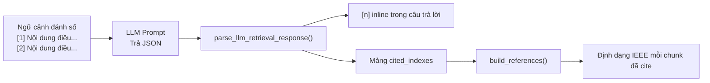

**Định dạng trích dẫn pháp luật** (`citations.py`):
```
[n] topic_title, subject_title, article_title, chapter_title — source_link
```

**Định dạng trích dẫn web:**
```
[n] title — URL (source_type: "web")
```

Chỉ chunk có index trong `cited_indexes` mới xuất hiện trong mảng `reference`.

---

## Thiết kế database

### Sơ đồ quan hệ thực thể

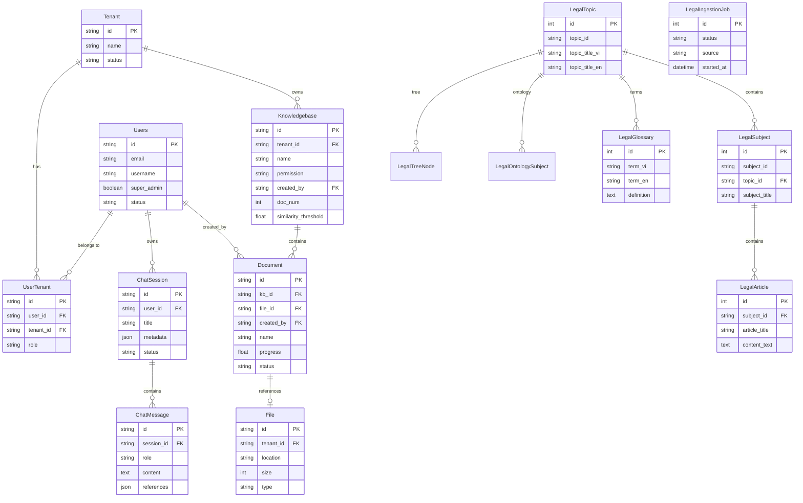

### Ranh giới sở hữu

| Domain | Owner | Lưu trữ |
| ------ | ----- | ------- |
| **Danh tính user** | Auth service | PostgreSQL `users`, `tenants`, `user_tenants` |
| **Phiên chat** | Chat service | PostgreSQL `chat_sessions`, `chat_messages` |
| **KB user** | Document service | PostgreSQL metadata + MinIO blobs + ES `user_documents` |
| **Corpus pháp luật** | Admin service | PostgreSQL `legal_*` + ES `lex_chunks_v1` |
| **Bản nháp hợp đồng** | Task execution | MinIO (DOCX có version) + metadata phiên |
| **Hàng đợi task** | Worker | Redis Streams |

### Elasticsearch indices

| Index | Biến môi trường | Field chính |
| ----- | --------------- | ----------- |
| `lex_chunks_v1` | `LEX_CHUNKS_INDEX` | `article_id`, `topic_id`, `subject_id`, `content_text`, `content_vector`, `source_link`, `order`, `parent_chunk_id` |
| `user_documents` | `USER_DOCUMENTS_INDEX` | `chunk_id`, `user_id`, `kb_id`, `document_id`, `content_text`, `content_vector` |

Tham chiếu schema: `api/db/elastic_index.json`

---

## Tài liệu API

Tất cả endpoint trả envelope chuẩn: `{ "code": int, "msg": string, "data": object }`.

Xác thực: Bearer JWT qua header `Authorization` (trừ OAuth login).

### Xác thực

| Method | Path | Auth | Mục đích |
| ------ | ---- | ---- | -------- |
| `POST` | `/v1/user/oAuth-login` | Không | Đổi Google OAuth code lấy JWT; tự tạo user/tenant/KB |

**Input:** `{ "code": "google_oauth_code" }`  
**Output:** `{ "token": "jwt...", "user": { id, email, role, ... } }`

### Chat & Phiên người dùng

| Method | Path | Auth | Mục đích |
| ------ | ---- | ---- | -------- |
| `POST` | `/v1/user/user_chat` | JWT | **Endpoint chat chính** — định tuyến intent + LangGraph orchestrator |
| `POST` | `/v1/user/chat` | JWT + super_admin | Retrieval trực tiếp (bỏ qua orchestrator) |
| `GET` | `/v1/user/sessions` | JWT | Danh sách phiên chat (phân trang) |
| `GET` | `/v1/user/session` | JWT | Chi tiết phiên kèm tin nhắn |
| `DELETE` | `/v1/user/chat` | JWT | Xóa mềm phiên chat |
| `POST` | `/v1/user/upload` | JWT | Upload file vào phiên chat (PDF/DOCX/ảnh) |

**Input `POST /v1/user/user_chat`:**
```json
{
  "query": "string",
  "session_id": "string",
  "thread_id": "string (tùy chọn, HITL resume)",
  "resume": { "action": "string", "payload": {} },
  "ui_template": "task_execution (tùy chọn, bỏ qua intent routing)",
  "topic_ids": ["string"],
  "subject_ids": ["string"],
  "candidate_size": 100,
  "similarity_threshold": 0.5,
  "final_size": 5,
  "keyword_weight": 0.3
}
```

**Output:**
```json
{
  "code": 0,
  "data": {
    "answer": "string với trích dẫn [n] inline",
    "reference": [{ "ieee": "string", "score": 0.9, "metadata": {} }],
    "intent": "information",
    "answer_mode": "grounded",
    "status": "completed | waiting_human",
    "hitl": { "kind": "form_fill", "form_schema": {} }
  }
}
```

### Điền hợp đồng / Bản nháp

| Method | Path | Auth | Mục đích |
| ------ | ---- | ---- | -------- |
| `POST` | `/v1/user/contract/fill` | JWT | Điền hợp đồng (JSON hoặc SSE nếu `stream=true`) |
| `GET` | `/v1/user/contract/draft/preview` | JWT | Preview bản nháp markdown |
| `GET` | `/v1/user/contract/draft/versions` | JWT | Danh sách phiên bản DOCX trên MinIO |
| `GET` | `/v1/user/contract/draft/preview/binary` | JWT | DOCX binary inline |
| `GET` | `/v1/user/contract/draft/preview/html` | JWT | Preview HTML từ DOCX |
| `GET` | `/v1/user/contract/draft` | JWT | Tải bản nháp DOCX |

### Tài liệu / Knowledge Base

| Method | Path | Auth | Mục đích |
| ------ | ---- | ---- | -------- |
| `GET` | `/v1/docs` | JWT | Danh sách tài liệu KB (phân trang) |
| `POST` | `/v1/doc/upload` | JWT | Upload file vào KB |
| `POST` | `/v1/doc/upload_via_url` | JWT | Crawl URL → PDF → upload |
| `GET` | `/v1/doc/content` | JWT | Stream file blob từ MinIO |
| `GET` | `/v1/doc` | JWT | Presigned URL cho tài liệu |
| `DELETE` | `/v1/doc` | JWT | Xóa mềm tài liệu (chỉ owner) |
| `POST` | `/v1/doc/run` | JWT | Enqueue job parse/embedding |

### Admin corpus pháp luật

| Method | Path | Auth | Mục đích |
| ------ | ---- | ---- | -------- |
| `GET` | `/v1/admin/doc/topic` | JWT + super_admin | List/chi tiết chủ đề pháp luật |
| `GET` | `/v1/admin/doc/subject` | JWT + super_admin | List/chi tiết đề mục |
| `GET` | `/v1/admin/doc/articles` | JWT + super_admin | Điều luật theo đề mục |
| `POST` | `/v1/admin/doc/retrieval` | JWT + super_admin | ES search → rerank → LLM trực tiếp |
| `POST` | `/v1/admin/doc/upload` | JWT + super_admin | Import dataset HuggingFace Pháp điển |

### Model Serving (Độc lập)

| Dịch vụ | Endpoints | Cổng |
| ------- | --------- | ---- |
| Vietnamese Embedding v2 | `GET /health`, `POST /v1/embeddings` | 6501 |
| Phi3 LLM Proxy | `GET /health`, `POST /v1/chat/completions` | 8000 |

---

## Kiến trúc triển khai

### Docker Compose Stack

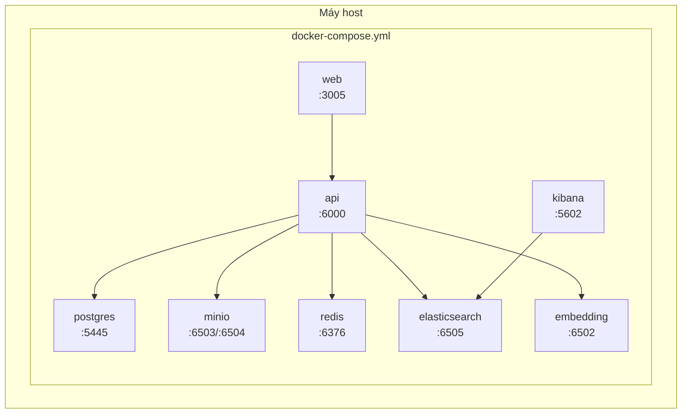

**Lệnh khởi động:**
```bash
cp .env.example .env
docker compose -f docker/docker-compose.yml up -d --build
```

### Bản đồ dịch vụ

| Dịch vụ | Container | Cổng host | Cổng nội bộ | Health check |
| ------- | --------- | --------- | ----------- | ------------ |
| PostgreSQL | `lex-postgres` | 5445 | 5432 | `pg_isready` |
| MinIO | `lex-minio` | 6503/6504 | 9000/9001 | `/minio/health/live` |
| Redis | `lex-redis` | 6376 | 6379 | `redis-cli ping` |
| Elasticsearch | `lex-elasticsearch` | 6505 | 9200 | cluster health |
| Kibana | `lex-kibana` | 5602 | 5601 | `/api/status` |
| Embedding | `lex-embedding` | 6502 | 6501 | `/health` |
| API | `lex-api` | 6000 | 5999 | `/openapi.json` |
| Web | `lex-web` | 3005 | 3004 | `/` |

### Biến môi trường

Biến quan trọng (xem `.env.example` để biết danh sách đầy đủ):

| Nhóm | Biến | Bắt buộc |
| ---- | ---- | -------- |
| **Database** | `POSTGRES_USER`, `POSTGRES_PASSWORD`, `POSTGRES_DB`, `POSTGRES_HOST`, `POSTGRES_PORT` | Có |
| **Object Storage** | `MINIO_HOST`, `MINIO_USER`, `MINIO_PASSWORD`, `MINIO_BUCKET` | Có |
| **Search** | `ELASTIC_HOST`, `ELASTIC_PASSWORD`, `LEX_CHUNKS_INDEX`, `LEGAL_VECTOR_DIMS` | Có |
| **LLM** | `OPENAI_API_KEY`, `OPENAI_BASE_URL`, `LLM_MODEL` | Có |
| **Embedding** | `EMBEDDING_PROVIDER`, `EMBEDDING_BASE_URL`, `EMBEDDING_MODEL` | Có |
| **Auth** | `JWT_SECRET_KEY`, `GOOGLE_CLIENT_ID`, `GOOGLE_CLIENT_SECRET` | Có |
| **Redis** | `REDIS_HOST`, `REDIS_PORT`, `REDIS_PASSWORD` | Tùy chọn (worker tắt nếu thiếu) |
| **Rerank** | `RERANK_ENABLED`, `RERANK_MODEL_NAME` | Khuyến nghị |
| **Web Search** | `TAVILY_API_KEY` | Tùy chọn (fallback tắt nếu thiếu) |
| **Frontend** | `NEXT_PUBLIC_API_SERVER`, `NEXT_PUBLIC_GOOGLE_CLIENT_ID` | Có (build-time) |

Override nội bộ Docker: `docker/docker-compose.env` remap hostname sang tên service container.

### Ghi chú triển khai production

1. **Chưa có pipeline CI/CD** trong repository *(suy luận từ implementation)*. Triển khai thủ công qua Docker Compose.

2. **Elasticsearch** yêu cầu `vm.max_map_count=262144` trên host Linux.

3. **Dịch vụ embedding** có thời gian khởi động dài (~5 phút) do load model; API phụ thuộc health embedding.

4. **Reranker** load lúc API startup — request đầu có thể chậm; khuyến nghị GPU qua `RERANK_DEVICE=cuda:0`.

5. **Checkpointer** dùng `InMemorySaver` — trạng thái HITL mất khi restart API. Production nên implement checkpointer Redis/Postgres (scaffold đã có).

6. **Venv riêng:** `.venv` root cho API; dịch vụ `model_serving/` có thể có venv GPU độc lập.

### Mạng

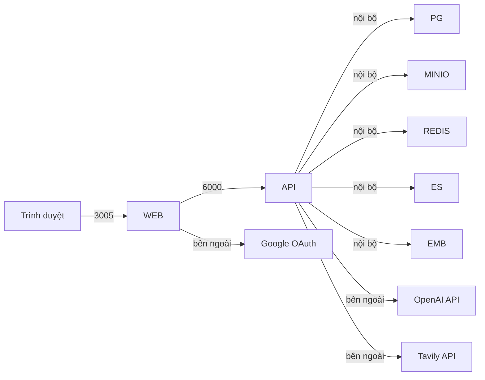

Trong Docker Compose, giao tiếp giữa các service dùng tên container (vd. `postgres`, `elasticsearch`). Container API đọc `docker-compose.env` để override hostname localhost.

---

## Phụ lục: Tóm tắt công nghệ

| Tầng | Công nghệ |
| ---- | --------- |
| **Frontend** | Next.js 16, React 19, TanStack Query, Tailwind CSS 4, i18next |
| **Backend** | FastAPI, Uvicorn, Peewee, Pydantic v2, Loguru |
| **AI/Agent** | LangGraph, LangChain, FlagEmbedding |
| **Search** | Elasticsearch 8.13, hybrid keyword + KNN |
| **Embedding** | AITeamVN/Vietnamese_Embedding_v2 (1024d) |
| **Reranking** | BAAI/bge-reranker-v2-m3 |
| **LLM** | OpenAI-compatible (GPT-4 class) |
| **Document** | Docling, PyMuPDF, python-docx, WeasyPrint |
| **Storage** | PostgreSQL, MinIO, Redis |
| **Package Manager** | uv (Python), npm (Frontend) |
| **Containerization** | Docker Compose |

---

*Sinh từ phân tích codebase. Cập nhật lần cuối: Tháng 6/2026.*
